---
## Front matter
lang: ru-RU
title: Лабораторная работа №1. 
subtitle: Введение в Mininet
author:
  - Тазаева А. А.
institute:
  - Российский университет дружбы народов, Москва, Россия

## i18n babel
babel-lang: russian
babel-otherlangs: english

## Formatting pdf
toc: false
toc-title: Содержание
slide_level: 2
aspectratio: 169
section-titles: true
theme: metropolis
header-includes:
 - \metroset{progressbar=frametitle,sectionpage=progressbar,numbering=fraction}
---

# Цели и задачи работы

Основной целью работы является развёртывание в системе виртуализации (например, в VirtualBox) mininet, знакомство с основными командами для работы с Mininet через командную строку и через графический интерфейс.

## Настройка стенда виртуальной машины Mininet

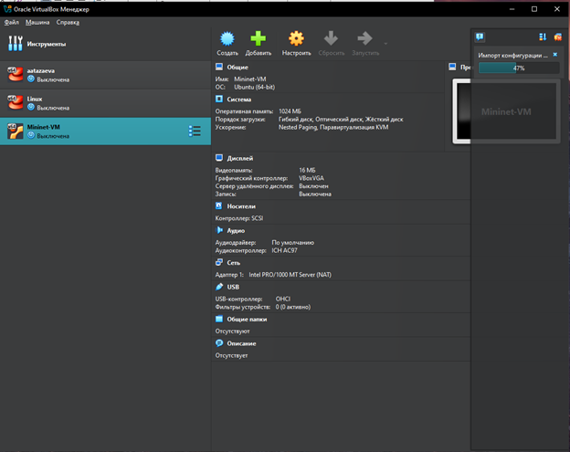{#fig:001 width=70%}

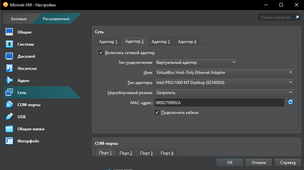{#fig:002 width=70%}

## Подключение к виртуальной машине

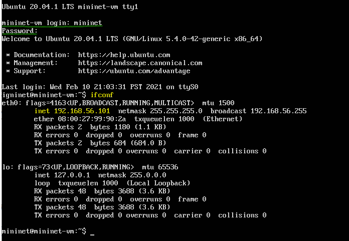{#fig:003 width=70%}

## Подключение к виртуальной машине

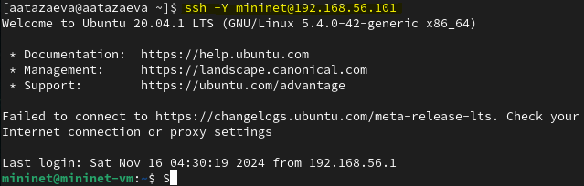{#fig:004 width=70%}

## Обновление версии mininet

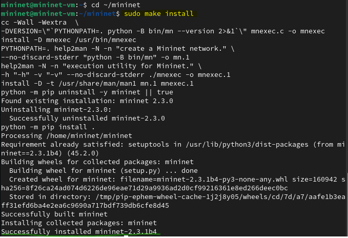{#fig:005 width=70%}

## Работа с Mininet с помощью командной строки

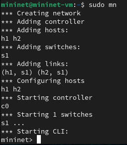{#fig:023 width=70%}

## Работа с Mininet с помощью командной строки

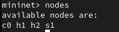{#fig:025 width=70%}

## Работа с Mininet с помощью командной строки

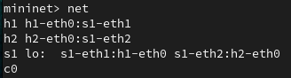{#fig:026 width=70%}

## Работа с Mininet с помощью командной строки

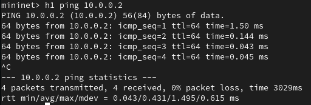{#fig:029 width=70%}

## Построение и эмуляция сети в Mininet с использованием графического интерфейса

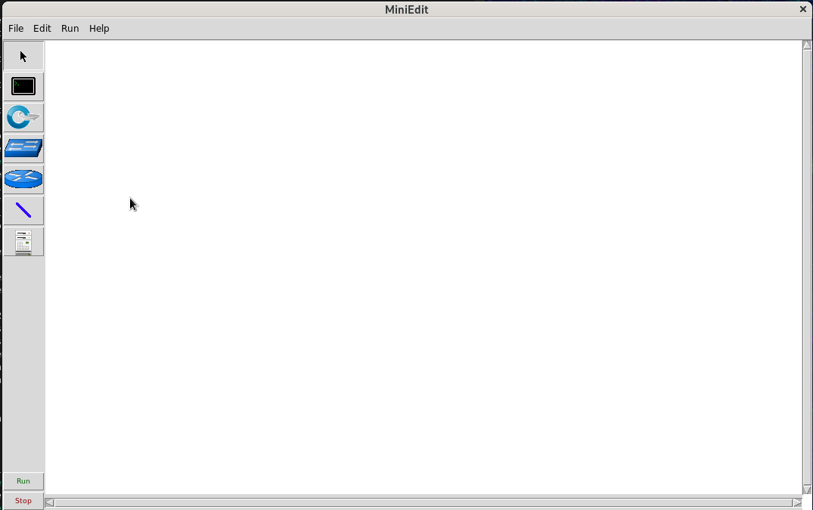{#fig:031 width=70%}

## Построение и эмуляция сети в Mininet с использованием графического интерфейса

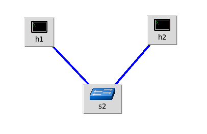{#fig:032 width=70%}

## Построение и эмуляция сети в Mininet с использованием графического интерфейса

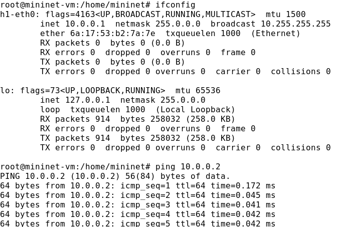{#fig:036 width=70%}

## Построение и эмуляция сети в Mininet с использованием графического интерфейса

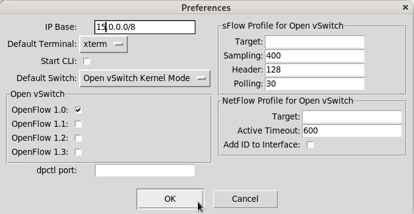{#fig:038 width=70%}

# Выводы по проделанной работе

В ходе лабораторной работы мною была развёрнута в системе виртуализации VirtualBox виртуальная среда mininet. Я познакомилась с основными командами для работы с Mininet через командную строку и через графический интерфейс.
