---
## Front matter
title: "Лабораторная работа №1"
subtitle: "Введение в Mininet"
author: "Тазаева Анастасия Анатольевна"

## Generic otions
lang: ru-RU
toc-title: "Содержание"

## Bibliography
bibliography: bib/cite.bib
csl: pandoc/csl/gost-r-7-0-5-2008-numeric.csl

## Pdf output format
toc: true # Table of contents
toc-depth: 2
lof: true # List of figures
lot: true # List of tables
fontsize: 12pt
linestretch: 1.5
papersize: a4
documentclass: scrreprt
## I18n polyglossia
polyglossia-lang:
  name: russian
  options:
	- spelling=modern
	- babelshorthands=true
polyglossia-otherlangs:
  name: english
## I18n babel
babel-lang: russian
babel-otherlangs: english
## Fonts
mainfont: IBM Plex Serif
romanfont: IBM Plex Serif
sansfont: IBM Plex Sans
monofont: IBM Plex Mono
mathfont: STIX Two Math
mainfontoptions: Ligatures=Common,Ligatures=TeX,Scale=0.94
romanfontoptions: Ligatures=Common,Ligatures=TeX,Scale=0.94
sansfontoptions: Ligatures=Common,Ligatures=TeX,Scale=MatchLowercase,Scale=0.94
monofontoptions: Scale=MatchLowercase,Scale=0.94,FakeStretch=0.9
mathfontoptions:
## Biblatex
biblatex: true
biblio-style: "gost-numeric"
biblatexoptions:
  - parentracker=true
  - backend=biber
  - hyperref=auto
  - language=auto
  - autolang=other*
  - citestyle=gost-numeric
## Pandoc-crossref LaTeX customization
figureTitle: "Рис."
tableTitle: "Таблица"
listingTitle: "Листинг"
lofTitle: "Список иллюстраций"
lotTitle: "Список таблиц"
lolTitle: "Листинги"
## Misc options
indent: true
header-includes:
  - \usepackage{indentfirst}
  - \usepackage{float} # keep figures where there are in the text
  - \floatplacement{figure}{H} # keep figures where there are in the text
---

# Цель работы

Основной целью работы является развёртывание в системе виртуализации (например, в VirtualBox) mininet, знакомство с основными командами для работы с Mininet через командную строку и через графический интерфейс.

# Выполнение лабораторной работы

## Настройка стенда виртуальной машины Mininet

### Настройка образа VitrualBox

1. С репозитория Mininet был скачан и распакован актуальный релиз ovf-образа виртуальной машины.

2. Далее запустила VitrualBox и импортировала файл .ovf (рис. [-@fig:001]). Необходимо было проверить настройки и исправить неправильные , что я и сделала. В нашем случае нужно было изменить тип графического контроллера (рис. [-@fig:002] и [-@fig:003]).

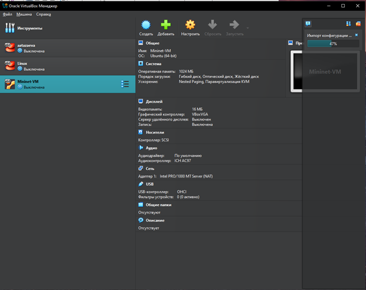{#fig:001 width=70%}

{#fig:002 width=70%}

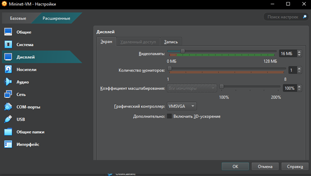{#fig:003 width=70%}

3. В настройках сети первый адаптер должен иметь подключение типа NAT (рис. [-@fig:004]). Для второго адаптера указала тип подключения host-only network adapter (виртуальный адаптер хоста) (рис. [-@fig:004]).

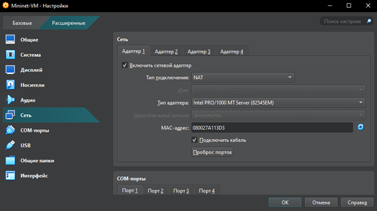{#fig:004 width=70%}

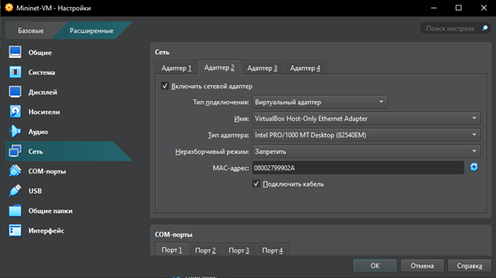{#fig:005 width=70%}

4. Запустила виртуальную машину с Mininet.

### Подключение к виртуальной машине

1. Залогинилась в виртуальной маине, введя логин и пароль (рис. [-@fig:006]). Также просмотрела адрес машины - 192.168.56.101.

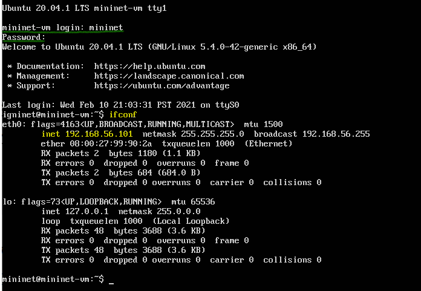{#fig:006 width=70%}

2. Подключилась к виртуальной машине из терминала хостовой машины с помощью команды ssh -Y mininet@192.168.56.101 (рис. [-@fig:007]). Отключилась с помощью комбинации клавиш Ctrl + d. 

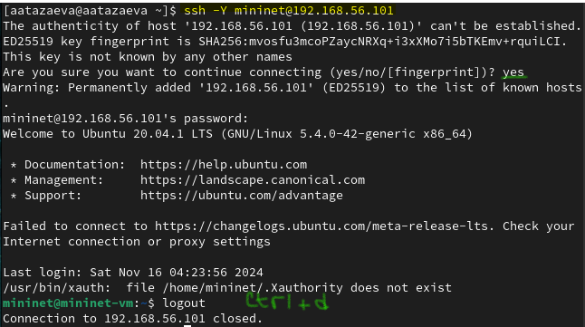{#fig:007 width=70%}

3. Настроила ssh-подсоединение по ключу к виртуальной машине, для чего в терминале основной Linux-машины перешла в каталог .ssh своего домашнего каталога, ввела ssh-copy-id mininet@192.168.56.101. Вновь подключилась к виртуальной машине и убедилась, что подсоединение происходит успешно и без ввода пароля (рис. [-@fig:008]).

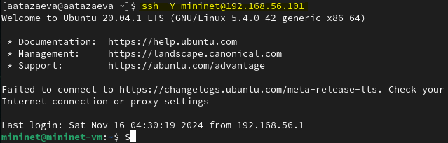{#fig:008 width=70%}

### Настройка доступа к Интернету

1. После подключения к виртуальной машине mininet посмотрела IP-адреса машины с помощью команды ifconfig (рис. [-@fig:009]). Для доступа к сети Интернет должен быть активен адрес NAT: 10.0.0.x. В нашем случае его нет, так что активировала интерфейс, набрав в командной строке sudo dhclient eth1 (рис. [-@fig:010]).

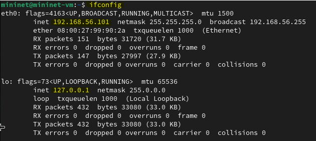{#fig:009 width=70%}

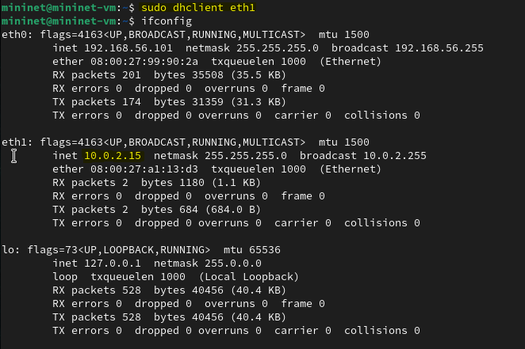{#fig:010 width=70%}

2. Для дальнейшей работы установила mc (рис. [-@fig:011]). 

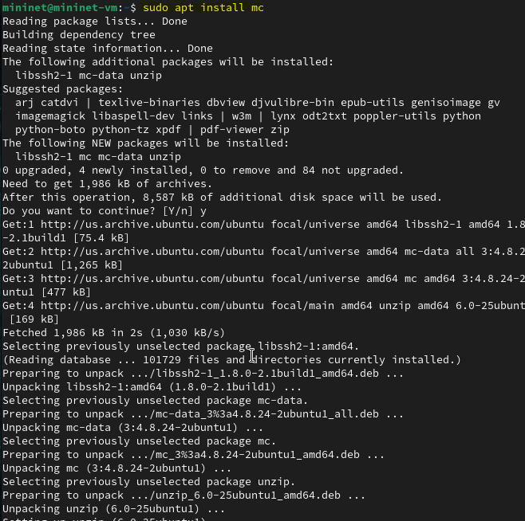{#fig:011 width=70%}

3. Для удобства дальнейшей работы добавила для mininet указание на использование двух адаптеров при запуске. Для этого требовалось перейти в режим суперпользователя и внести изменения в файл /etc/netplan/01-netcfg.yaml виртуальной машины mininet `sudo mcedit /etc/netplan/01-netcfg.yaml` (рис. [-@fig:012]).

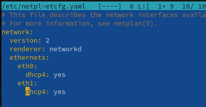{#fig:012 width=70%}

### Обновление версии mininet

1. В виртуальной машине mininet переименовала предыдущую установку Mininet `mv ~/mininet ~/mininet.orig` (рис. [-@fig:013]).

{#fig:013 width=70%}

2. Скачала новую версию Mininet (рис. [-@fig:014]).

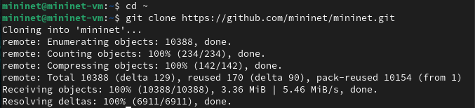{#fig:014 width=70%}

3. Обновила исполняемые файлы (рис. [-@fig:015]).

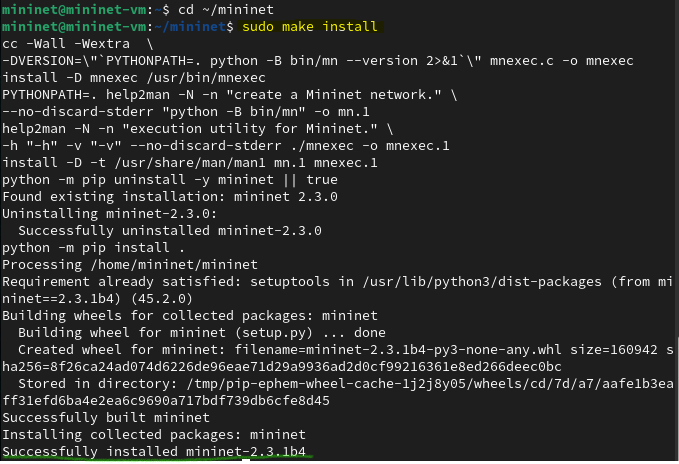{#fig:015 width=70%}

4. Проверила номер установленной версии mininet (рис. [-@fig:016]).
Описываются проведённые действия, в качестве иллюстрации даётся ссылка на иллюстрацию (рис. [-@fig:001]).

{#fig:016 width=70%}

### Настройка параметров XTerm

1. По умолчанию XTerm использует растровые шрифты малого кегля. Для увеличения размера шрифта и применения векторных шрифтов вместо растровых необходимо внести изменения в файл /etc/X11/app-defaults/XTerm (рис. [-@fig:017]). Выбран системный моноширинный шрифт, кегль шрифта — 12 пунктов.

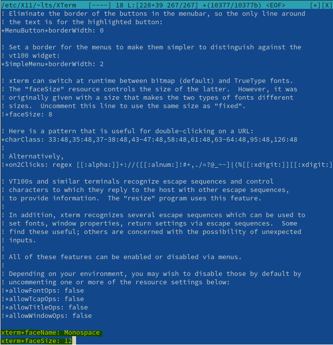{#fig:017 width=70%}

### Настройка соединения X11 для суперпользователя

1. При попытке запуска приложения из-под суперпользователя возникает ошибка (рис. [-@fig:018]).

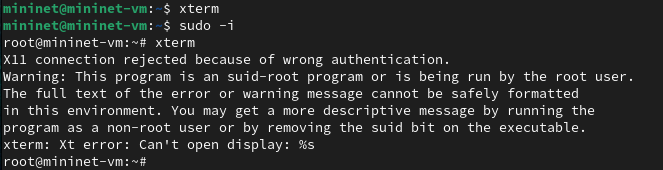{#fig:018 width=70%}

2. Для исправления этой ситуации заполнила файл полномочий /root/.Xauthority , используя утилиту xauth. Скопировала значение куки (MIT magic cookie) 1 пользователя mininet в файл
для пользователя root (рис. [-@fig:019], [-@fig:020], [-@fig:021], [-@fig:022]).

{#fig:019 width=70%}

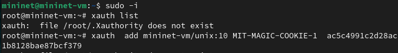{#fig:020 width=70%}

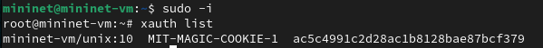{#fig:021 width=70%}

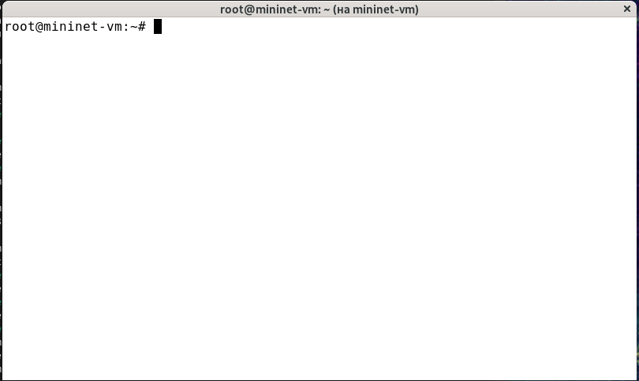{#fig:022 width=70%}

## Основы работы в Mininet

### Работа с Mininet с помощью командной строки

1. Для запуска минимальной топологии ввела в командной строке `sudo mn`(рис. [-@fig:023]). Эта команда запускает Mininet с минимальной топологией, состоящей из коммутатора, подключённого к двум хостам.

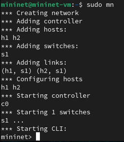{#fig:023 width=70%}

2. Для отображения списка команд интерфейса командной строки Mininet и примеров их использования введила команду в интерфейсе командной строки Mininet `help`(рис. [-@fig:024]). 

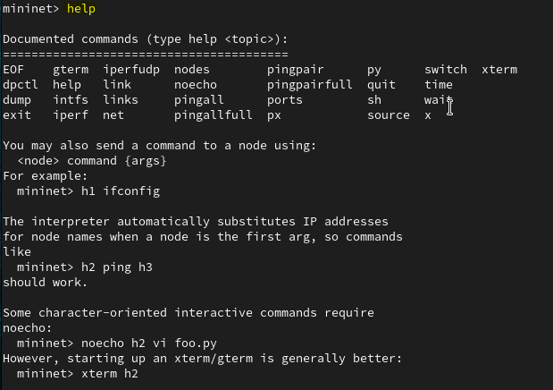{#fig:024 width=70%}

3. Для отображения доступных узлов ввела `nodes` (рис. [-@fig:025]). Вывод этой команды показывает, что есть два хоста (хост h1 и хост h2 ) и коммутатор ( s1 ).

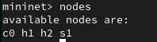{#fig:025 width=70%}

4. Введила команду net в интерфейсе командной строки Mininet(рис. [-@fig:026]), чтобы просмотреть доступные линки. 

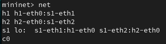{#fig:026 width=70%}

Вывод этой команды показывает:
– Хост h1 подключён через свой сетевой интерфейс h1-eth0 к коммутатору на интерфейсе s1-eth1 .
– Хост h2 подключён через свой сетевой интерфейс h2-eth0 к коммутатору на интерфейсе s1-eth2 .
– Коммутатор s1 :
	- имеет петлевой интерфейс lo .
	– подключается к h1-eth0 через интерфейс s1-eth1 .
	– подключается к h2-eth0 через интерфейс s1-eth2 .

5. Посмотрела конфигурацию всех узлов. h1 (рис. [-@fig:027]) - 10.0.0.1, h2 (рис. [-@fig:027]) - 10.0.0.2, s1 (рис. [-@fig:028]). 

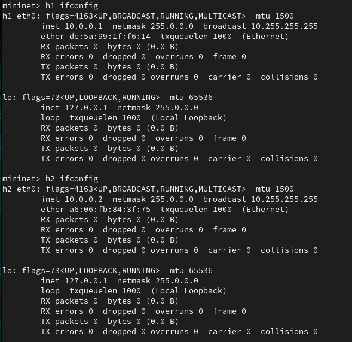{#fig:027 width=70%}

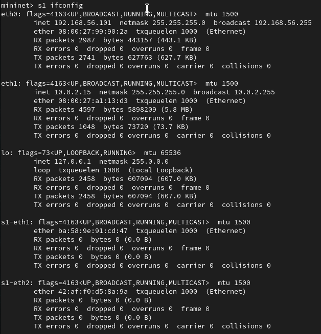{#fig:028 width=70%}

6. Проверка связности. Чтобы проверить связь между узлами, использовала команду ping (рис. [-@fig:029]). Команда ping работает, отправляя сообщения эхо-запроса протокола управляющих сообщений Интернета (ICMP) на удалённый компьютер и ожидая ответа.

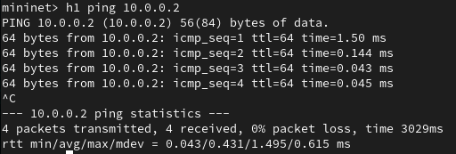{#fig:029 width=70%}

7. Остановила эмуляцию (рис. [-@fig:030]).

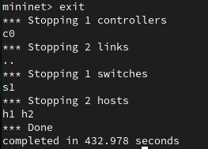{#fig:030 width=70%}

### Построение и эмуляция сети в Mininet с использованием графического интерфейса

1. В терминале виртуальной машины mininet запустила MiniEdit с помощью команды `sudo ~/mininet/mininet/examples/miniedit.py` (рис. [-@fig:031]).

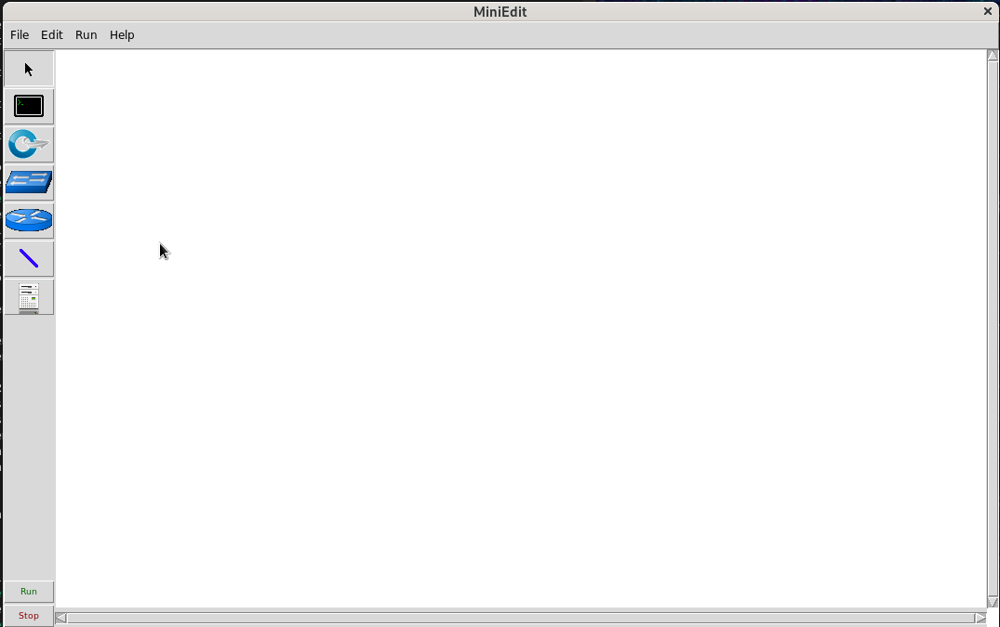{#fig:031 width=70%}

2. Добавила два хоста и один коммутатор, соединила хосты с коммутатором (рис. [-@fig:032]). Настроила IP-адреса на хостах h1 (рис. [-@fig:033]) и h2 (рис. [-@fig:034]).

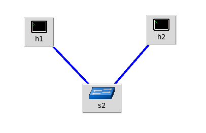{#fig:032 width=70%}

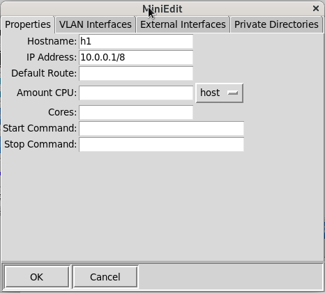{#fig:033 width=70%}

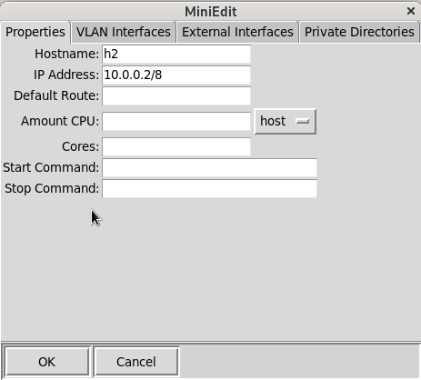{#fig:034 width=70%}

3. Проверка связности. Запустила эмуляцию (рис. [-@fig:035]). И пропинговала с терминала хоста 
h1 хост h2 (рис. [-@fig:036]), предварительно просмотрев их адреса (рис. [-@fig:036] и [-@fig:037])

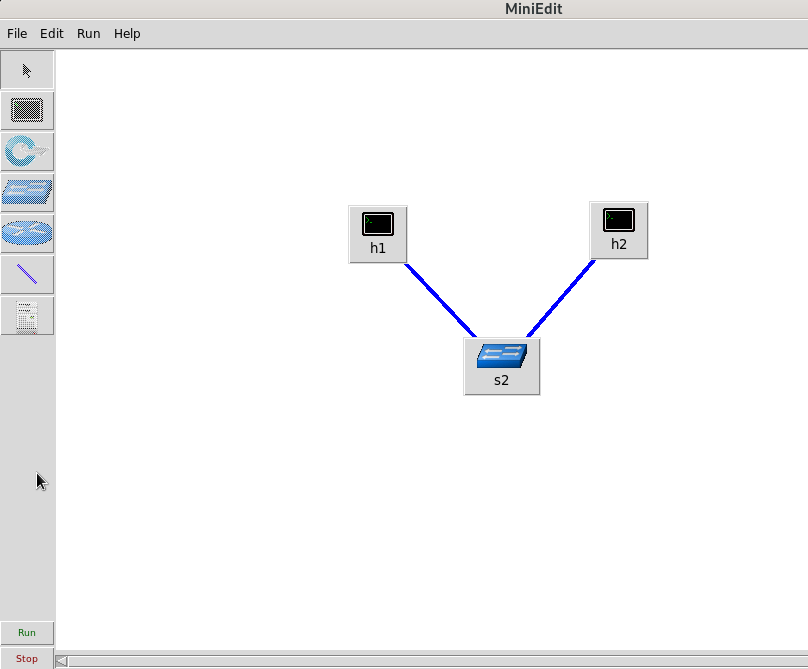{#fig:035 width=70%}

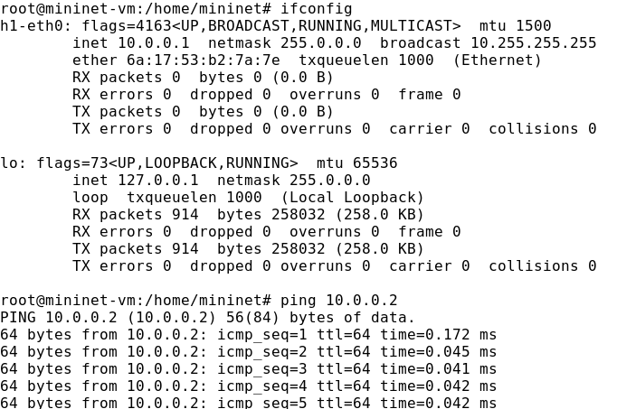{#fig:036 width=70%}

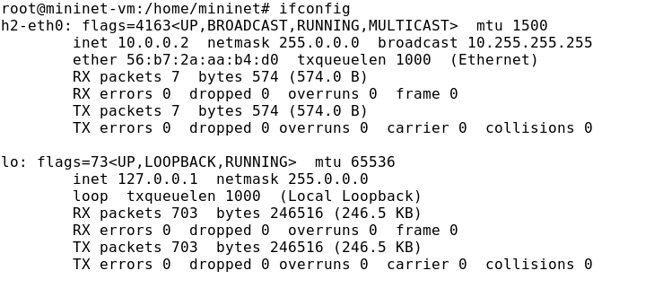{#fig:037 width=70%}

3. Автоматическое назначение IP-адресов. Ранее IP-адреса узлам h1 и h2 были назначены вручную. В качестве альтернативы можно полагаться на Mininet для автоматического назначения IP-адресов. Удалила назначенные вручную адреса для хостов 1 и 2. В MiniEdit нажала Edit Preferences . По умолчанию в поле базовые значения IP-адресов (IP Base) установлено 10.0.0.0/8 . Изменила это значение на 15.0.0.0/8 (рис. [-@fig:038]). Запустила эмуляцию, отобразила IP-адреса, назначенные хосту h1 и h2 (рис. [-@fig:039] и [-@fig:040]). Интерфейс h1-eth0 на узле h1 теперь имеет IP-адрес 15.0.0.1 и маску подсети 255.0.0.0.

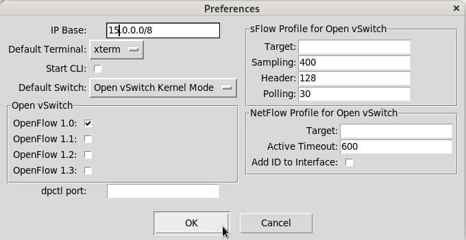{#fig:038 width=70%}

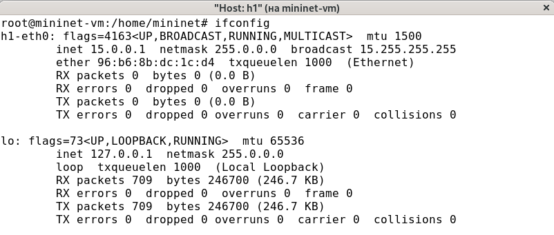{#fig:039 width=70%}

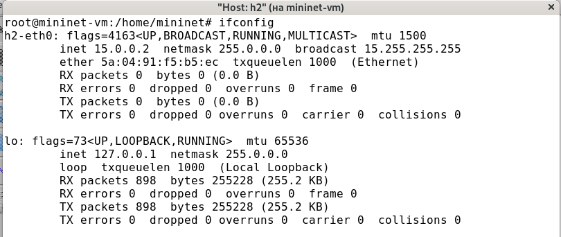{#fig:040 width=70%}

4. Сохранение и загрузка топологии Mininet. Создала каталог work, сохранила топологию и поменяла права доступа к файлам в каталоге проекта (рис. [-@fig:041]).

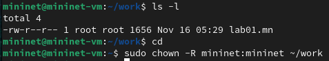{#fig:041 width=70%}

# Выводы

В ходе лабораторной работы мною была развёрнута в системе виртуализации VirtualBox виртуальная среда mininet. Я познакомилась с основными командами для работы с Mininet через командную строку и через графический интерфейс.

