---
## Front matter
lang: ru-RU
title: Лабораторная работа №2. 
subtitle: Измерение и тестирование пропускной способности сети. Интерактивный эксперимент
author:
  - Тазаева А. А.
institute:
  - Российский университет дружбы народов, Москва, Россия

## i18n babel
babel-lang: russian
babel-otherlangs: english

## Formatting pdf
toc: false
toc-title: Содержание
slide_level: 2
aspectratio: 169
section-titles: true
theme: metropolis
header-includes:
 - \metroset{progressbar=frametitle,sectionpage=progressbar,numbering=fraction}
---

# Цели и задачи работы

Основной целью работы является знакомство с инструментом для измерения пропускной способности сети в режиме реального времени — iPerf3, а также получение навыков проведения интерактивного эксперимента по измерению пропускной способности моделируемой сети в среде Mininet.

## Установка необходимого программного обеспечения

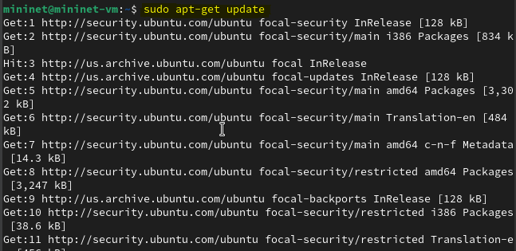{#fig:003 width=70%}

## Установка необходимого программного обеспечения

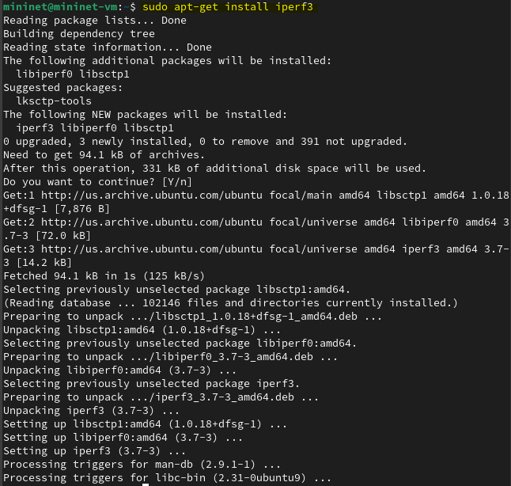{#fig:004 width=70%}

## Установка необходимого программного обеспечения

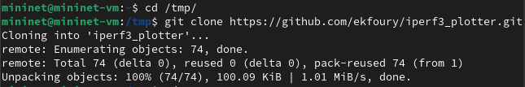{#fig:006 width=70%}

## Установка необходимого программного обеспечения

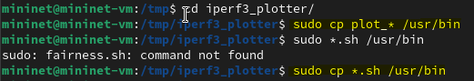{#fig:007 width=70%}

## Интерактивные эксперименты 

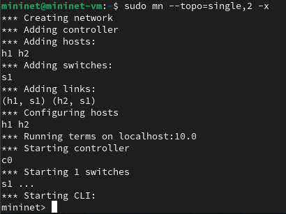{#fig:010 width=70%}

## Интерактивные эксперименты 

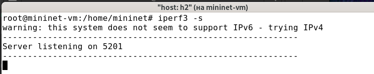{#fig:013 width=70%}

## Интерактивные эксперименты 

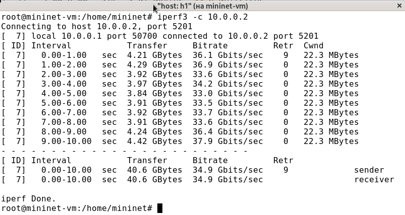{#fig:014 width=70%}

## Интерактивные эксперименты 

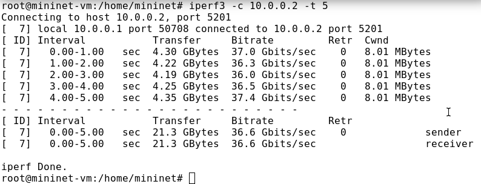{#fig:017 width=70%}

## Интерактивные эксперименты 

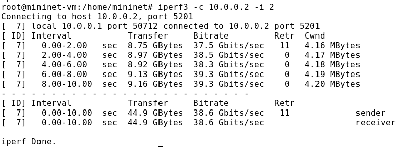{#fig:019 width=70%}

## Интерактивные эксперименты 

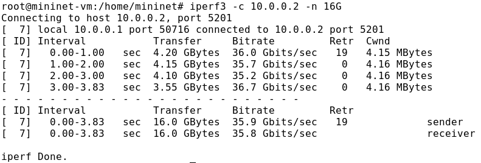{#fig:020 width=70%}

## Интерактивные эксперименты 

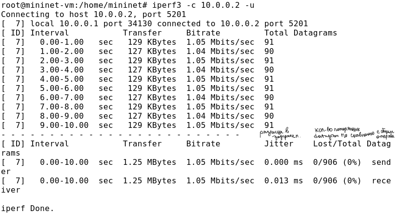{#fig:021 width=70%}

## Интерактивные эксперименты 

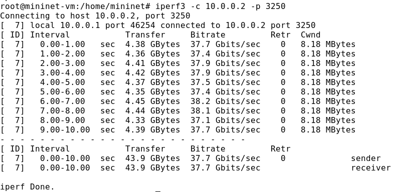{#fig:023 width=70%}

## Интерактивные эксперименты 

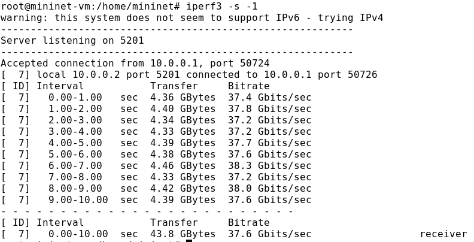{#fig:024 width=70%}	

## Интерактивные эксперименты 

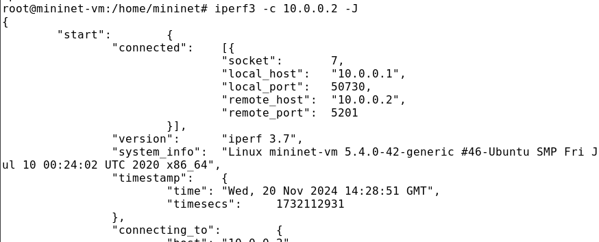{#fig:025 width=70%}

## Интерактивные эксперименты 

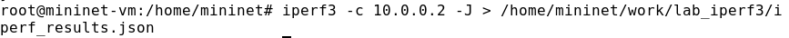{#fig:026 width=70%}

## Интерактивные эксперименты 

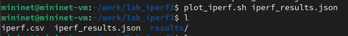{#fig:029 width=70%}

## Интерактивные эксперименты 

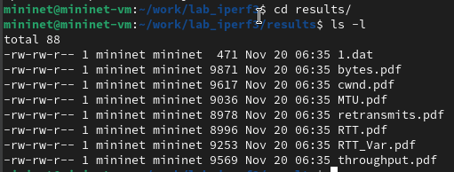{#fig:030 width=70%}

## Интерактивные эксперименты 

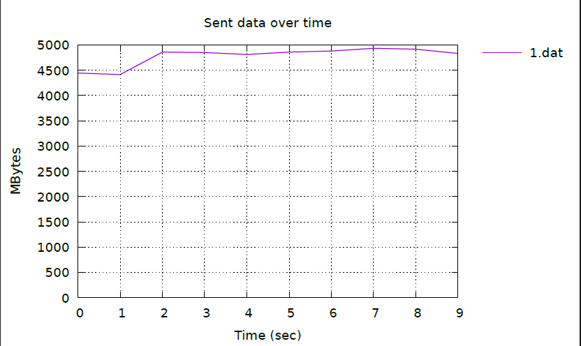{#fig:037 width=70%}

## Интерактивные эксперименты 

# Выводы по проделанной работе

В ходе лабораторной работы я познакомилась с инструментом для измерения пропускной способности сети в режиме реального времени — iPerf3, а также получила навыки проведения интерактивного эксперимента по измерению пропускной способности моделируемой сети в среде Mininet.

