---
## Front matter
title: "Лабораторная работа №2"
subtitle: "Измерение и тестирование пропускной способности сети. Интерактивный эксперимент"
author: "Тазаева Анастасия Анатольевна"

## Generic otions
lang: ru-RU
toc-title: "Содержание"

## Bibliography
bibliography: bib/cite.bib
csl: pandoc/csl/gost-r-7-0-5-2008-numeric.csl

## Pdf output format
toc: true # Table of contents
toc-depth: 2
lof: true # List of figures
lot: true # List of tables
fontsize: 12pt
linestretch: 1.5
papersize: a4
documentclass: scrreprt
## I18n polyglossia
polyglossia-lang:
  name: russian
  options:
	- spelling=modern
	- babelshorthands=true
polyglossia-otherlangs:
  name: english
## I18n babel
babel-lang: russian
babel-otherlangs: english
## Fonts
mainfont: IBM Plex Serif
romanfont: IBM Plex Serif
sansfont: IBM Plex Sans
monofont: IBM Plex Mono
mathfont: STIX Two Math
mainfontoptions: Ligatures=Common,Ligatures=TeX,Scale=0.94
romanfontoptions: Ligatures=Common,Ligatures=TeX,Scale=0.94
sansfontoptions: Ligatures=Common,Ligatures=TeX,Scale=MatchLowercase,Scale=0.94
monofontoptions: Scale=MatchLowercase,Scale=0.94,FakeStretch=0.9
mathfontoptions:
## Biblatex
biblatex: true
biblio-style: "gost-numeric"
biblatexoptions:
  - parentracker=true
  - backend=biber
  - hyperref=auto
  - language=auto
  - autolang=other*
  - citestyle=gost-numeric
## Pandoc-crossref LaTeX customization
figureTitle: "Рис."
tableTitle: "Таблица"
listingTitle: "Листинг"
lofTitle: "Список иллюстраций"
lotTitle: "Список таблиц"
lolTitle: "Листинги"
## Misc options
indent: true
header-includes:
  - \usepackage{indentfirst}
  - \usepackage{float} # keep figures where there are in the text
  - \floatplacement{figure}{H} # keep figures where there are in the text
---

# Цель работы

Основной целью работы является знакомство с инструментом для измерения пропускной способности сети в режиме реального времени — iPerf3, а также получение навыков проведения интерактивного эксперимента по измерению пропускной способности моделируемой сети в среде Mininet.

# Задание

1. Установить на виртуальную машину mininet iPerf3 и дополнительное программное обеспечение для визуализации и обработки данных.
2. Провести ряд интерактивных экспериментов по измерению пропускной способности с помощью iPerf3 с построением графиков.

# Выполнение лабораторной работы

## Установка необходимого программного обеспечения

1. Запустила виртуальную среду с mininet.

2. Из основной ОС подключилась к виртуальной машине (рис. [-@fig:001]) с помощью команды `ssh -Y mininet@192.168.56.101`.

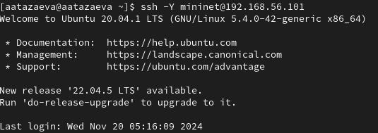{#fig:001 width=70%}

3. Проверила IP-адреса машины `ifconfig` (рис. [-@fig:002]), адрес NAT активен.

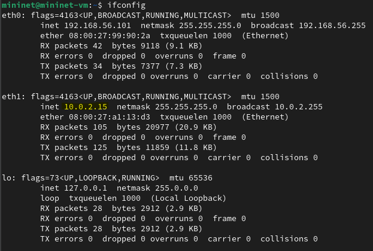{#fig:002 width=70%}

4. Обновила репозитории ПО на виртуальной машине (рис. [-@fig:003]): `sudo apt-get update`.

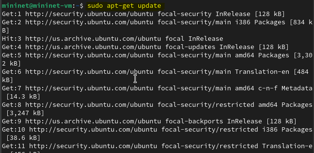{#fig:003 width=70%}

5. Установила iperf3 (рис. [-@fig:004]): `sudo apt-get install iperf3`.

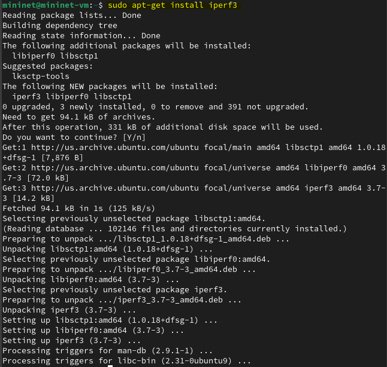{#fig:004 width=70%}

6. Установила необходимое дополнительное ПО на виртуальную машину (рис. [-@fig:005]): `sudo apt-get git jq gnuplot-nox evince`.

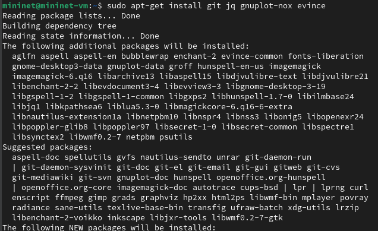{#fig:005 width=70%}

7. Установила iperf3_plotter, сначала скачав репозиторий во временный каталог(рис. [-@fig:006]), а потом перенесла исполняемые файлы в папку /usr/bin (рис. [-@fig:007]).

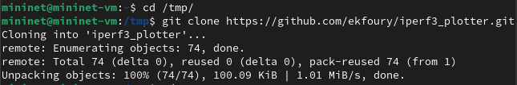{#fig:006 width=70%}

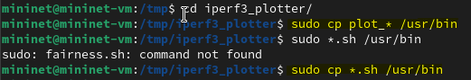{#fig:007 width=70%}

## Интерактивные эксперименты 

1. Попыталась задать простейшую топологию из двух хостов и коммутатора. Появилась ошибка X11 connection rejected because of wrong authentification (рис. [-@fig:008]). Исправила её (рис. [-@fig:009]) и повторно задала простейшую топологию (рис. [-@fig:010]): `sudo mn --topo=single,2 -x`. Открылись 4 терминала (рис. [-@fig:011]): два хоста, коммутатор и  контроллера. Терминалы коммутатора и контроллера нам не понадобятся, потому их просто закрыла.

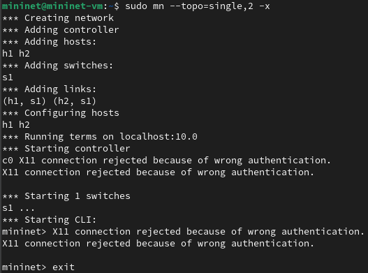{#fig:008 width=70%}

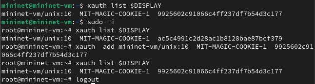{#fig:009 width=70%}

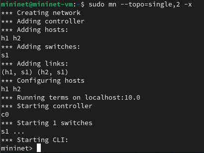{#fig:010 width=70%}

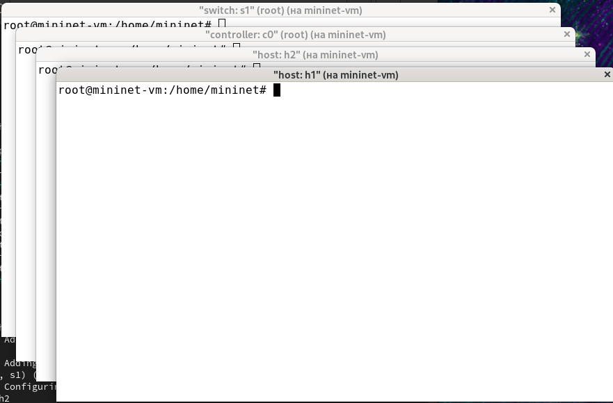{#fig:011 width=70%}

2. Посмотрела параметры запущенной в интерактивном режиме топологии (рис. [-@fig:012]).

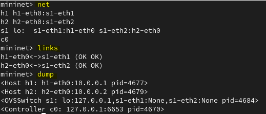{#fig:012 width=70%}

3. Провела простейший интерактивный эксперимент по измерению пропускной способности с помощью iperf3. Для этого сначала в терминале хоста 2 h2 запустила *сервер* iperf3 (рис. [-@fig:013]): `iperf3 -s`. После запуска этой команды хост перешел в режим прослушивания 5201-го порта в ожидании входящих подключений. Далее после запуска сервера в терминале хоста 1 h1  запустила *клиент* iperf3 (рис. [-@fig:014]): `iperf3 -c 10.0.0.2`.

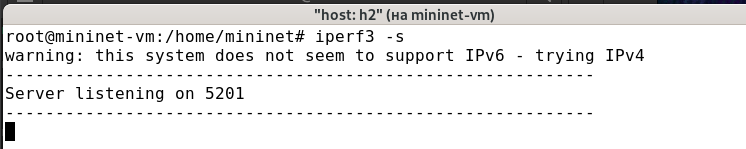{#fig:013 width=70%}

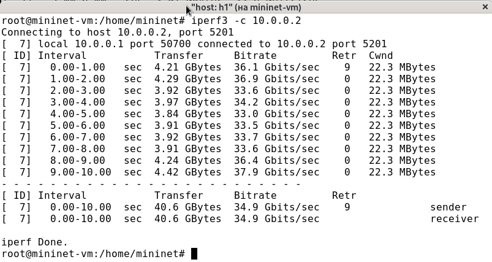{#fig:014 width=70%}

Начался тест с измерением пропускной способности, который длился 10 секунд по умолчанию. В итоге мы получили следующие данные:
- ID: идентификационный номер соединения.
- интервал (Interval): временной интервал для периодических отчетов о пропускной способности (по умолчанию временной интервал равен 1 секунде);
- передача (Transfer): сколько данных было передано за каждый интервал времени;
- пропускная способность (Bitrate): измеренная пропускная способность в каждом временном интервале;
- Retr: количество повторно переданных TCP-сегментов за каждый временной интервал (это поле увеличивается, когда TCP-сегменты теряются в сети из-за перегрузки или повреждения);
- Cwnd: указывает размер окна перегрузки в каждом временном интервале (TCP использует эту переменную для ограничения объёма данных, которые TCP-клиент может отправить до получения подтверждения отправленных данных).
Суммарные данные на сервере аналогичны данным на стороне клиента iPerf3 и должны интерпретироваться таким же образом.

4. Провела аналогичный эксперимент только в интерфейсе mininet (рис. [-@fig:015] и [-@fig:016]). 

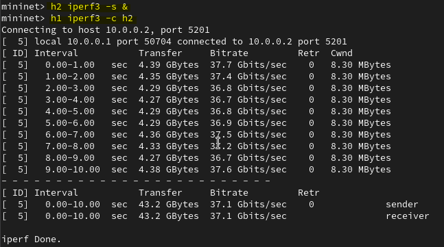{#fig:015 width=70%}

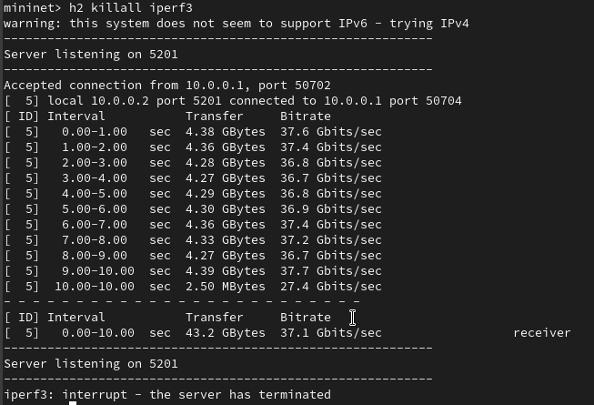{#fig:016 width=70%}

5. Для указания iPerf3 периода времени для передачи можно использовать ключ -t (или --time) — время в секундах для передачи (по умолчанию 10 секунд). Сначала запустила сервер. Далее запустила клиент iPerf3 с параметром -t, за которым следует количество секунд (рис. [-@fig:017]): `iperf3 -c 10.0.0.2 -t 5`

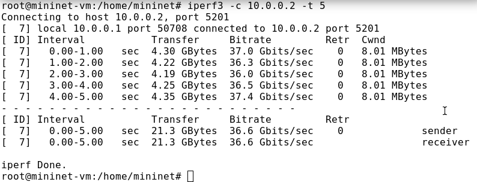{#fig:017 width=70%}

6. Настроила клиент iPerf3 для выполнения теста пропускной способности с 2-секундным интервалом времени отсчёта как на клиенте, так и на сервере. Использовала опцию -i для установки интервала между отсчётами, измеряемого в секундах:

- В терминале h2 запустила сервер iPerf3 (рис. [-@fig:018]):
	`iperf3 -s -i 2`
- В терминале h1 запустила клиент iPerf3 (рис. [-@fig:019]):
	`iperf3 -c 10.0.0.2 -i 2`
	
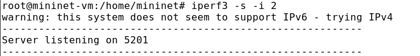{#fig:018 width=70%}

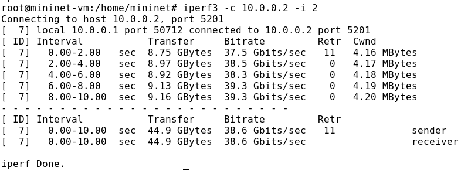{#fig:019 width=70%}

Как мы видим ничего, кроме интервала не поменялось. Общее кол-во переданных данных и пропускная способность не поменялись.

7. Задала на клиенте iPerf3 отправку определённого объёма данных. Использовала опцию -n для установки количества байт для передачи:

- В терминале h2 запустила сервер iPerf3:
	`iperf3 -s`
- В терминале h1 запустила клиент iPerf3, задав объём данных 16 Гбайт (рис. [-@fig:020]):
	`iperf3 -c 10.0.0.2 -n 16G`

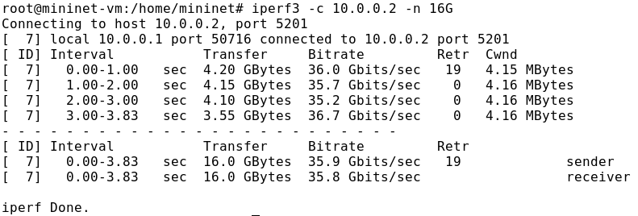{#fig:020 width=70%}
	
По умолчанию iPerf3 выполняет измерение пропускной способности в течение 10 секунд, но при задании количества данных для передачи клиент iPerf3 будет продолжать отправлять пакеты до тех пор, пока не будет отправлен весь объем данных, указанный пользователем.

8. Изменила в тесте измерения пропускной способности iPerf3 протокол передачи данных с TCP (установлен по умолчанию) на UDP. iPerf3 автоматически определяет протокол транспортного уровня на стороне сервера. Для изменения протокола использовала опцию -u на стороне клиента iPerf3:

- В терминале h2 запустила сервер iPerf3:
	`iperf3 -s`
- В терминале h1 запустила клиент iPerf3, задав протокол UDP (рис. [-@fig:021]):
	`iperf3 -c 10.0.0.2 -u`

После завершения теста отобразились следующие сводные данные:
- ID, интервал, передача, битрейт: то же, что и у TCP.
- Jitter: разница в задержке пакетов.
- Lost/Total: указывает количество потерянных дейтаграмм по сравнению с общим количеством отправленных на сервер (и процентное соотношение).

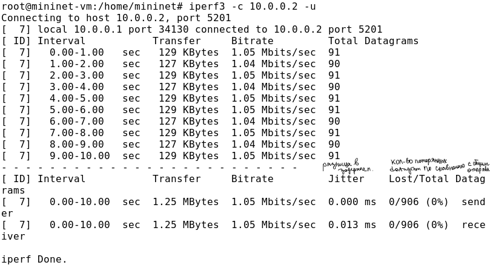{#fig:021 width=70%}

9. В тесте измерения пропускной способности iPerf3 изменила номер порта для отправки/получения пакетов или датаграмм через указанный порт. Использовала для этого опцию -p:

- В терминале h2 запустила сервер iPerf3, используя параметр -p, чтобы указать порт прослушивания (рис. [-@fig:022]):
	`iperf3 -s -p 3250`
- В терминале h1 запустила клиент iPerf3, указав порт (рис. [-@fig:023]):
	`iperf3 -c 10.0.0.2 -p 3250`

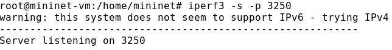{#fig:022 width=70%}

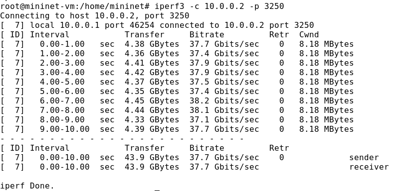{#fig:023 width=70%}

10. По умолчанию после запуска сервер iPerf3 постоянно прослушивает входящие соединения. В тесте измерения пропускной способности iPerf3 задала для сервера параметр обработки данных только от одного клиента с остановкой сервера по завершении теста. Для этого использовала опцию -1 на сервере iPerf3:

- В терминале h2 запустила сервер iPerf3, используя параметр -1, чтобы
принять только одного клиента (рис. [-@fig:024]):
	`iperf3 -s -1`
- В терминале h1 запустила клиент iPerf3:
	`iperf3 -c 10.0.0.2`
	
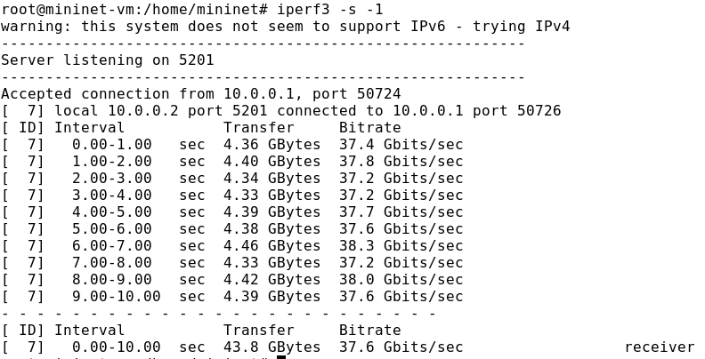{#fig:024 width=70%}	
	
После завершения этого теста сервер iPerf3 немедленно останавливается.

11. Экспортировала результаты теста измерения пропускной способности iPerf3 в файл JSON. Для этого в виртуальной машине mininet создала каталог для работы над проектом: `mkdir -p ~/work/lab_iperf3`. В терминале h2 запустила сервер iPerf3: `iperf3 -s`. В терминале h1 запустила клиент iPerf3, указав параметр -J для отображения вывода результатов в формате JSON (рис. [-@fig:025]): `iperf3 -c 10.0.0.2 -J`. 

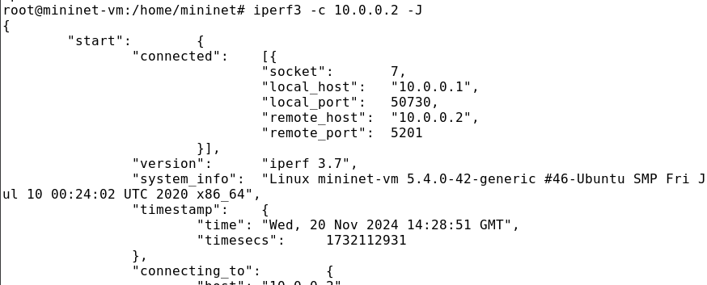{#fig:025 width=70%}	

В данном случае параметр -J выведет текст JSON на экран через стандартный вывод (stdout) после завершения теста. Экспортировала вывод результатов теста в файл, перенаправив стандартный вывод в файл (рис. [-@fig:026]): `iperf3 -c 10.0.0.2 -J > /home/mininet/work/lab_iperf3/iperf_results.json` Убедилась, что файл *iperf_results.json* создан в указанном каталоге. Для этого в терминале хоста h1 ввела следующие команды (рис. [-@fig:027]): `cd/home/mininet/work/lab_iperf3` и `ls -l`.

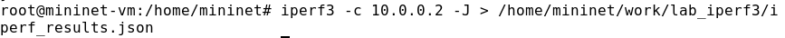{#fig:026 width=70%}	

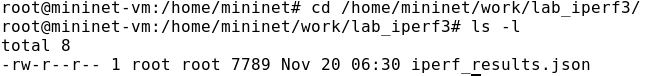{#fig:027 width=70%}	

12. Так как мы уже исправили права запуска X-соединения выше, то этот пункт пропустила.

13. В виртуальной машине mininet перешла в каталог для работы над проектом, проверила права, скорректировала их (рис. [-@fig:028]). 

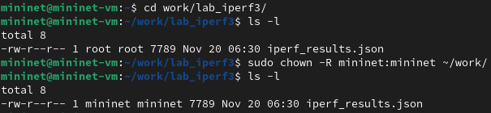{#fig:028 width=70%}

14. Сгенерировала выходные данные для файла JSON Iperf3 (рис. [-@fig:029]): `plot_iperf.sh iperf_results.json`

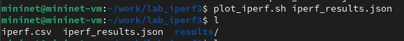{#fig:029 width=70%}

15. Сценарий построения создал файл CSV (1.dat) (рис. [-@fig:030]), который может использоваться другими приложениями. В подкаталоге results каталога, в котором был выполнен скрипт, сценарий создал графики для следующих полей файла JSON:

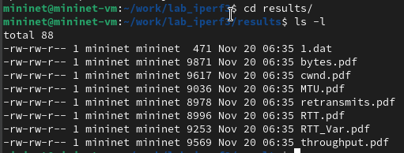{#fig:030 width=70%}

- окно перегрузки (cwnd.pdf) (рис. [-@fig:031]);

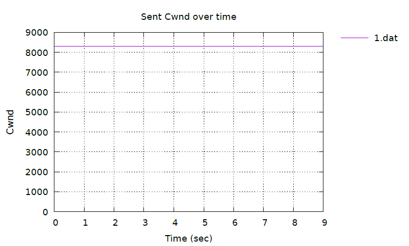{#fig:031 width=70%}

- повторная передача (retransmits.pdf) (рис. [-@fig:032]);

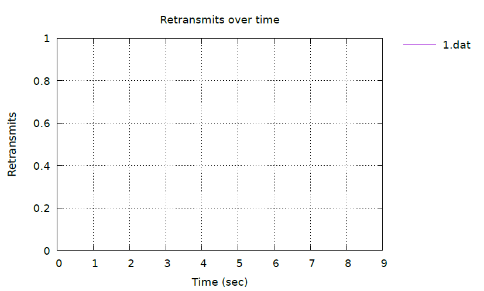{#fig:032 width=70%}

- время приема-передачи (RTT.pdf) (рис. [-@fig:033]);

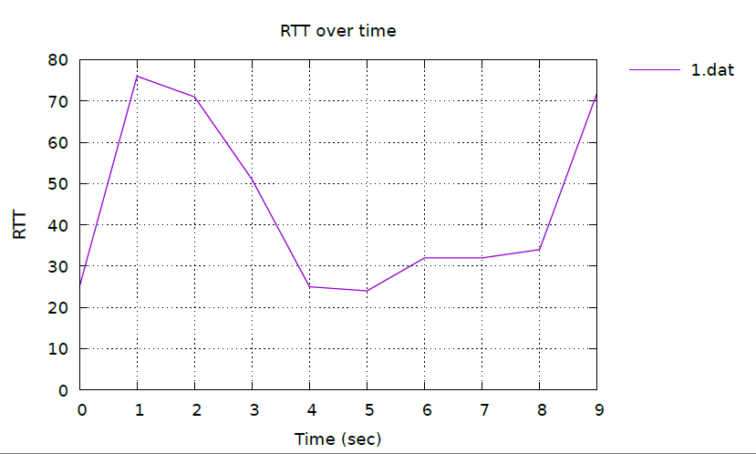{#fig:033 width=70%}

- отклонение времени приема-передачи (RTT_Var.pdf) (рис. [-@fig:034]);

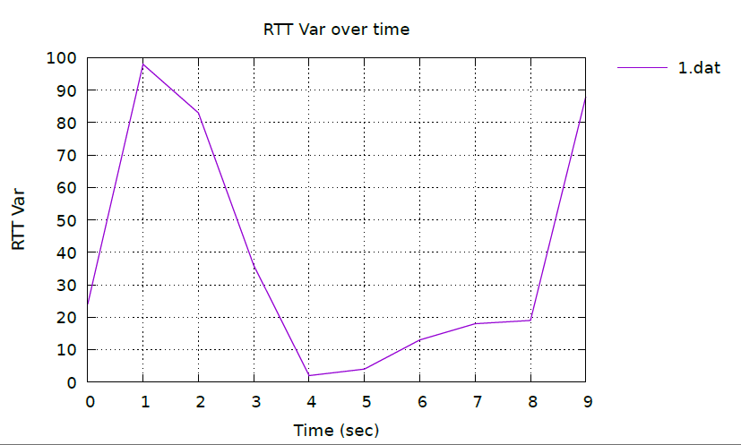{#fig:034 width=70%}

- пропускная способность (throughput.pdf) (рис. [-@fig:035]);

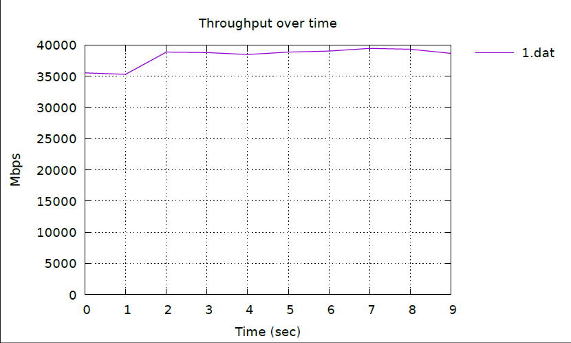{#fig:035 width=70%}

- максимальная единица передачи (MTU.pdf) (рис. [-@fig:036]);

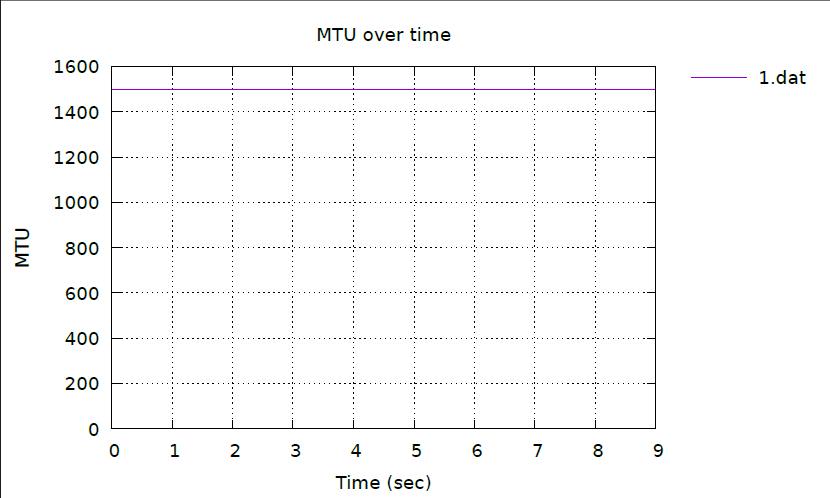{#fig:036 width=70%}

- количество переданных байтов (bytes.pdf)(рис. [-@fig:037]).

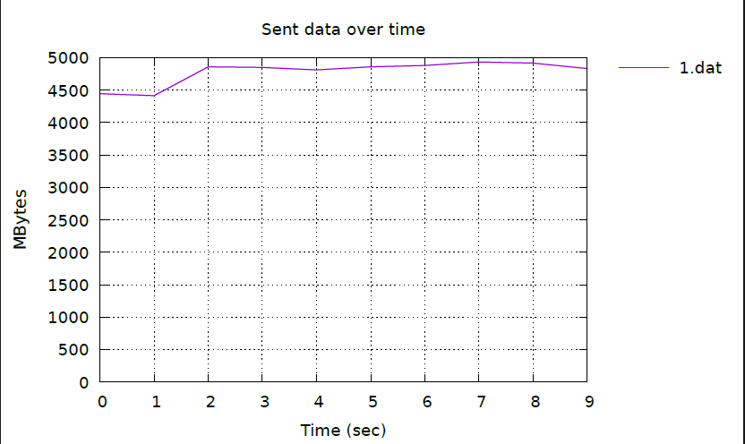{#fig:037 width=70%}

# Выводы

В ходе лабораторной работы я познакомилась с инструментом для измерения пропускной способности сети в режиме реального времени — iPerf3, а также получила навыки проведения интерактивного эксперимента по измерению пропускной способности моделируемой сети в среде Mininet.

