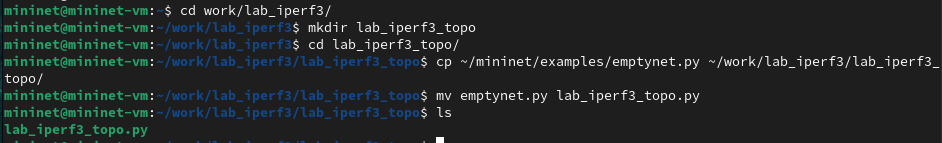
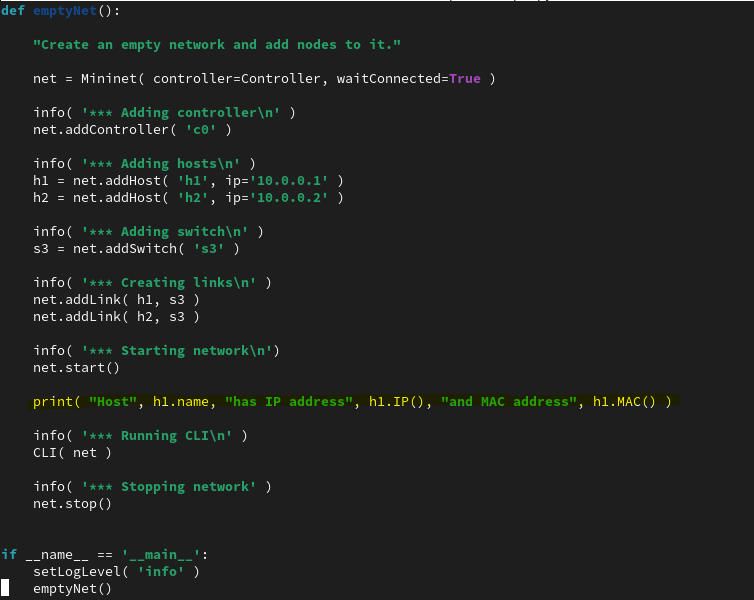
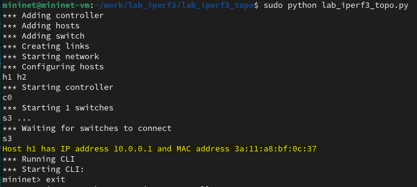
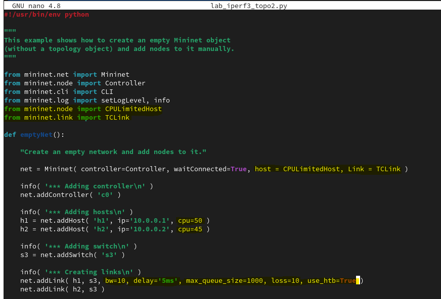
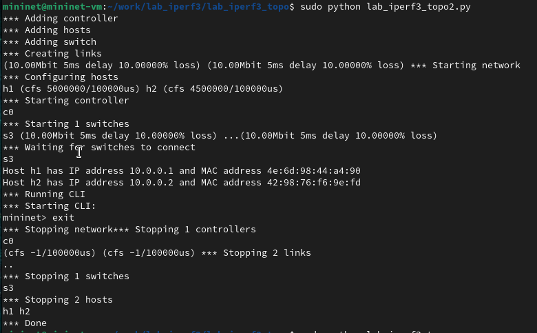
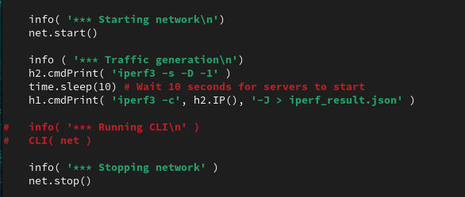
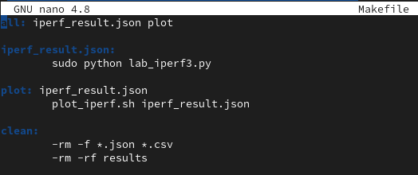
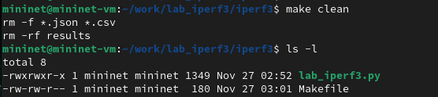
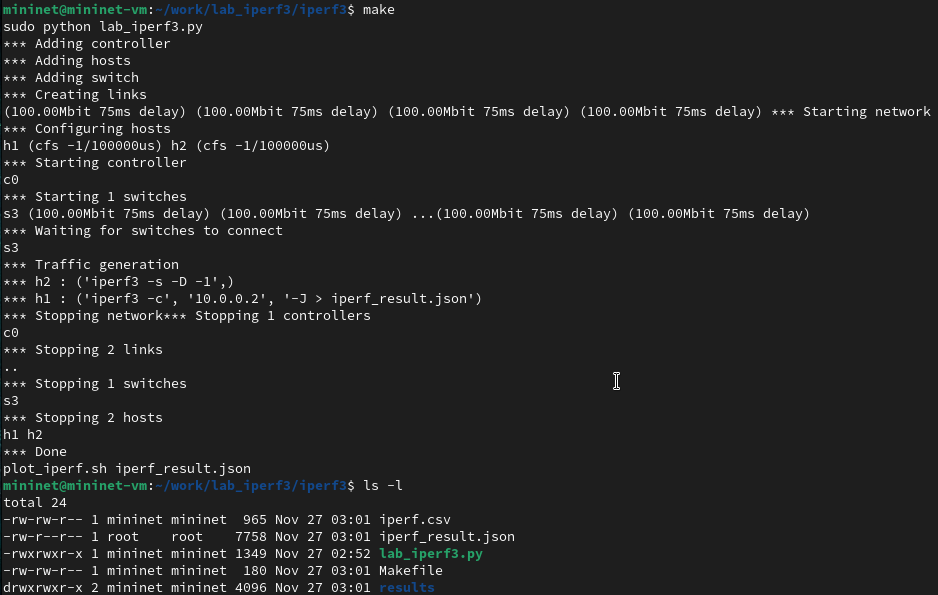

---
## Front matter
lang: ru-RU
title: Лабораторная работа №3. 
subtitle: Измерение и тестирование пропускной способности сети. Воспроизводимый эксперимент
author:
  - Тазаева А. А.
institute:
  - Российский университет дружбы народов, Москва, Россия

## i18n babel
babel-lang: russian
babel-otherlangs: english

## Formatting pdf
toc: false
toc-title: Содержание
slide_level: 2
aspectratio: 169
section-titles: true
theme: metropolis
header-includes:
 - \metroset{progressbar=frametitle,sectionpage=progressbar,numbering=fraction}
---

# Цели и задачи работы

Основной целью работы является знакомство с инструментом для измерения пропускной способности сети в режиме реального времени — iPerf3, а также получение навыков проведения воспроизводимого эксперимента по измерению пропускной способности моделируемой сети в среде Mininet.

## Выполнение лабораторной работы 

{#fig:001 width=70%}

## Редактирование скрипта

{#fig:003 width=70%}

## Запуск скрипта

{#fig:004 width=70%}

## Функции ограничения производительности и изоляции

{#fig:008 width=70%}

## Функции ограничения производительности и изоляции

{#fig:009 width=70%}

## Создание графиков

{#fig:013 width=70%}

## Создание Makefile

{#fig:016 width=70%}

## Проверка Makefile

{#fig:017 width=70%}

## Проверка Makefile

{#fig:018 width=70%}

# Выводы по проделанной работе

В ходе лабораторной работы я познакомилась с инструментом для измерения пропускной способности сети в режиме реального времени — iPerf3, а также получила навыки проведения воспроизводимого эксперимента по измерению пропускной способности моделируемой сети в среде Mininet.

