---
## Front matter
title: "Лабораторная работа №3"
subtitle: "Измерение и тестирование пропускной способности сети. Воспроизводимый эксперимент"
author: "Тазаева Анастасия Анатольевна"

## Generic otions
lang: ru-RU
toc-title: "Содержание"

## Bibliography
bibliography: bib/cite.bib
csl: pandoc/csl/gost-r-7-0-5-2008-numeric.csl

## Pdf output format
toc: true # Table of contents
toc-depth: 2
lof: true # List of figures
lot: true # List of tables
fontsize: 12pt
linestretch: 1.5
papersize: a4
documentclass: scrreprt
## I18n polyglossia
polyglossia-lang:
  name: russian
  options:
	- spelling=modern
	- babelshorthands=true
polyglossia-otherlangs:
  name: english
## I18n babel
babel-lang: russian
babel-otherlangs: english
## Fonts
mainfont: IBM Plex Serif
romanfont: IBM Plex Serif
sansfont: IBM Plex Sans
monofont: IBM Plex Mono
mathfont: STIX Two Math
mainfontoptions: Ligatures=Common,Ligatures=TeX,Scale=0.94
romanfontoptions: Ligatures=Common,Ligatures=TeX,Scale=0.94
sansfontoptions: Ligatures=Common,Ligatures=TeX,Scale=MatchLowercase,Scale=0.94
monofontoptions: Scale=MatchLowercase,Scale=0.94,FakeStretch=0.9
mathfontoptions:
## Biblatex
biblatex: true
biblio-style: "gost-numeric"
biblatexoptions:
  - parentracker=true
  - backend=biber
  - hyperref=auto
  - language=auto
  - autolang=other*
  - citestyle=gost-numeric
## Pandoc-crossref LaTeX customization
figureTitle: "Рис."
tableTitle: "Таблица"
listingTitle: "Листинг"
lofTitle: "Список иллюстраций"
lotTitle: "Список таблиц"
lolTitle: "Листинги"
## Misc options
indent: true
header-includes:
  - \usepackage{indentfirst}
  - \usepackage{float} # keep figures where there are in the text
  - \floatplacement{figure}{H} # keep figures where there are in the text
---

# Цель работы

Основной целью работы является знакомство с инструментом для измерения пропускной способности сети в режиме реального времени — iPerf3, а также получение навыков проведения воспроизводимого эксперимента по измерению пропускной способности моделируемой сети в среде Mininet.

# Задание

1. Воспроизвести посредством API Mininet эксперименты по измерению пропускной способности с помощью iPerf3
2. Построить графики по проведённому эксперименту.

# Выполнение лабораторной работы

1. Запустила виртуальную среду с mininet. Из основной ОС подключилась к виртуальной машине.

2. С помощью API Mininet создала простейшую топологию сети, состоящую из двух хостов и коммутатора с назначенной по умолчанию mininet сетью 10.0.0.0/8

- В каталоге `/work/lab_iperf3` для работы над проектом создала подкаталог `lab_iperf3_topo` и скопировала в него файл с примером скрипта `mininet/examples/emptynet.py`, описывающего стандартную простую топологию сети mininet (рис. [-@fig:001])

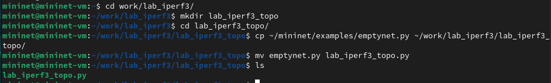{#fig:001 width=70%}

Изучила содержание скрипта. Основные элементы:

- addSwitch(): добавляет коммутатор в топологию и возвращает имя коммутатора;

- addHost(): добавляет хост в топологию и возвращает имя хоста;

- addLink(): добавляет двунаправленную ссылку в топологию (и возвращает ключ ссылки; ссылки в Mininet являются двунаправленными, если не указано иное);

- Mininet: основной класс для создания и управления сетью;

- start(): запускает сеть;

- pingAll(): проверяет подключение, пытаясь заставить все узлы пинговать друг друга;

- stop(): останавливает сеть;

- net.hosts: все хосты в сети;

- dumpNodeConnections(): сбрасывает подключения к/от набора узлов;

- setLogLevel( 'info' | 'debug' | 'output' ): устанавливает
уровень вывода Mininet по умолчанию; рекомендуется info.

Запустила скрипт создания топологии `lab_iperf3_topo.py` (рис. [-@fig:002]):

```
sudo python lab_iperf3_topo.py
```

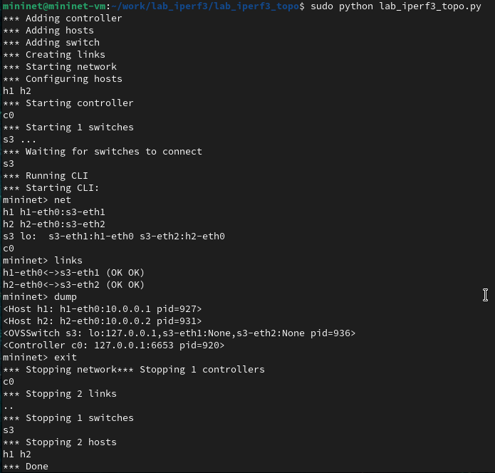{#fig:002 width=70%}

После отработки скрипта посмотрела элементы топологии и завершила работу mininet (рис. [-@fig:002]):

```
mininet> net
mininet> links
mininet> dump
mininet> exit
```
3. Внесла в скрипт `lab_iperf3_topo.py` изменение, позволяющее вывести на экран информацию о хосте h1, а именно имя хоста, его IP-адрес, MAC-адрес. Для этого после строки, задающей старт работы сети, добавила строку (рис. [-@fig:003]):
```
print( "Host", h1.name, "has IP address", h1.IP(), "and MAC address", h1.MAC() )
```

Здесь:
– IP() возвращает IP-адрес хоста или определенного интерфейса;
– MAC() возвращает MAC-адрес хоста или определенного интерфейса.

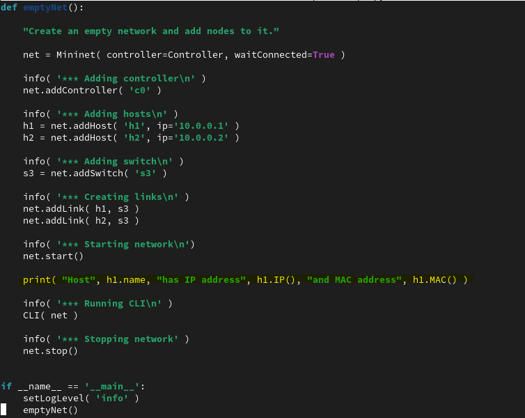{#fig:003 width=70%}

4. Проверила корректность отработки изменённого скрипта (рис. [-@fig:004]). Теперь перед запуском CLI появляется надпись с информацией о хосте h1.

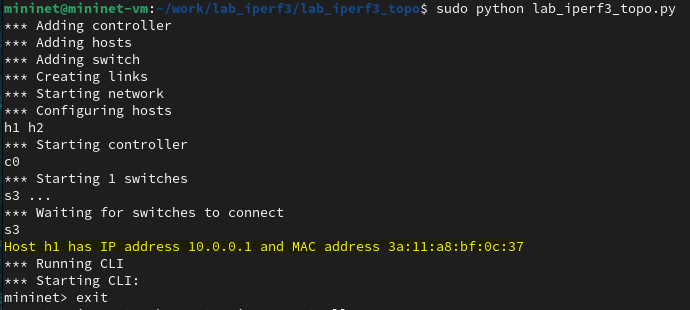{#fig:004 width=70%}

5. Изменила скрипт `lab_iperf3_topo.py` так, чтобы на экран выводилась информация об имени, IP-адресе и MAC-адресе обоих хостов сети (рис. [-@fig:005]). Проверила корректность отработки изменённого скрипта (рис. [-@fig:006]).

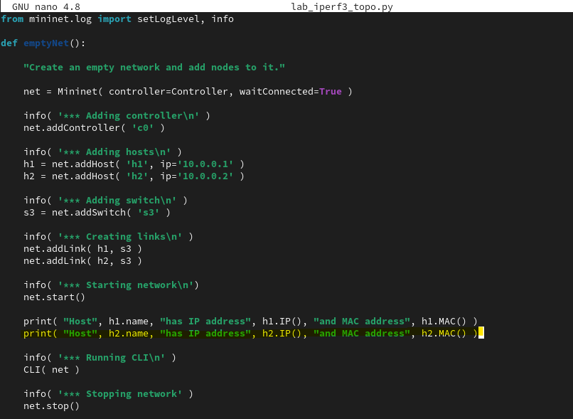{#fig:005 width=70%}

{#fig:006 width=70%}

6. Mininet предоставляет функции ограничения производительности и изоляции с помощью классов CPULimitedHost и TCLink. Добавила в скрипт настройки параметров производительности:

- Сделала копию скрипта `lab_iperf3_topo.py`:

```
cp lab_iperf3_topo.py lab_iperf3_topo2.py
```

- В начале скрипта `lab_iperf3_topo2.py` добавила записи об импорте классов CPULimitedHost и TCLink (рис. [-@fig:007]):

```
...
from mininet.node import CPULimitedHost
from mininet.link import TCLink
...
```

- В скрипте `lab_iperf3_topo2.py` изменила строку описания сети, указав на использование ограничения производительности и изоляции (рис. [-@fig:007]):

```
...
net = Mininet( controller=Controller, waitConnected=True, host = CPULimitedHost, link = TCLink )
...
```

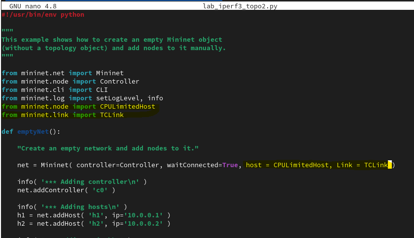{#fig:007 width=70%}

- В скрипте `lab_iperf3_topo2.py` изменила функцию задания параметров виртуального хоста h1, указав, что ему будет выделено 50% от общих ресурсов процессора системы (рис. [-@fig:008]):

```
...
h1 = net.addHost( 'h1', ip='10.0.0.1', cpu=50 )
...
```

- Аналогичным образом для хоста h2 задала долю выделения ресурсов процессора в 45% (рис. [-@fig:008]):

```
...
h2 = net.addHost( 'h2', ip='10.0.0.2', cpu=45 )
...
```

– В скрипте `lab_iperf3_topo2.py` изменила функцию параметров соединения между хостом h1 и коммутатором s3 (рис. [-@fig:008]):

```
...
net.addLink( h1, s3, bw=10, delay='5ms', max_queue_size=1000, loss=10, use_htb=True )
...
```

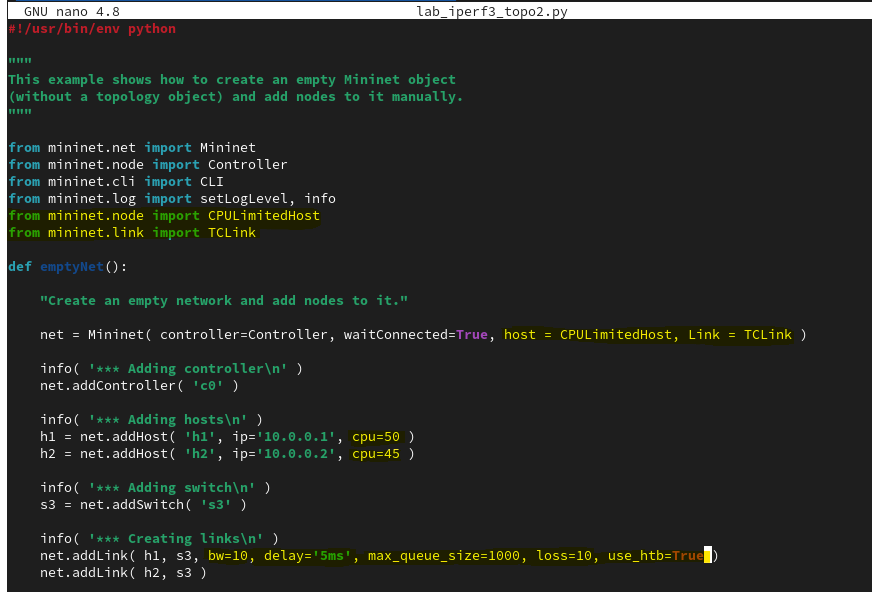{#fig:008 width=70%}

Здесь добавляется двунаправленный канал с характеристиками пропуск-
ной способности, задержки и потерь:
- параметр пропускной способности (bw) выражается числом в Мбит;
- задержка (delay) выражается в виде строки с заданными единицами измерения (например, 5ms, 100us, 1s);
- потери (loss) выражаются в процентах (от 0 до 100);
- параметр максимального значения очереди (max_queue_size) выража-ется в пакетах;
- параметр use_htb указывает на использование ограничителя интенсив-ности входящего потока Hierarchical Token Bucket (HTB).

Запустила на отработку сначала скрипт `lab_iperf3_topo2.py` (рис. [-@fig:009]), затем `lab_iperf3_topo.py` (рис. [-@fig:010]). Теперь появляется дополнительная информация, которую и меняли пунктом выше.

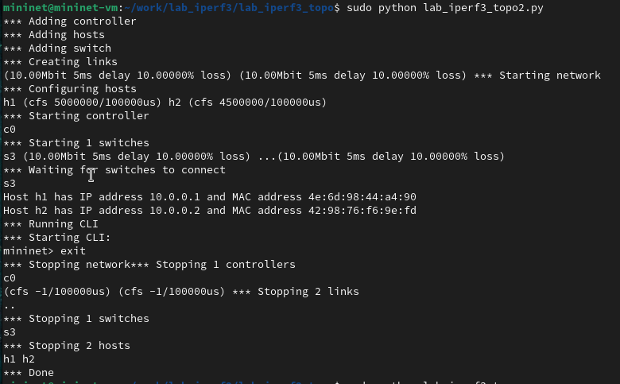{#fig:009 width=70%}

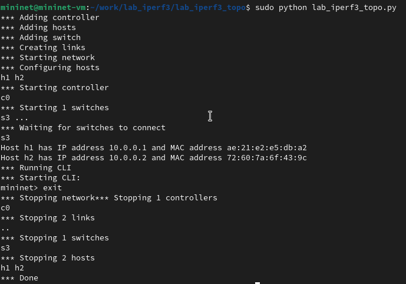{#fig:010 width=70%}

7. Теперь необходимо построить графики по проводимому эксперименту :

- Сделала копию скрипта `lab_iperf3_topo2.py` и поместила его в подкаталог iperf (рис. [-@fig:011]):

```
cp lab_iperf3_topo2.py lab_iperf3.py
mkdir -p ~/work/lab_iperf3/iperf3
mv ~/work/lab_iperf3/lab_iperf3_topo/lab_iperf3.py ~/work/lab_iperf3/iperf3
cd ~/work/lab_iperf3/iperf3
ls -l
```

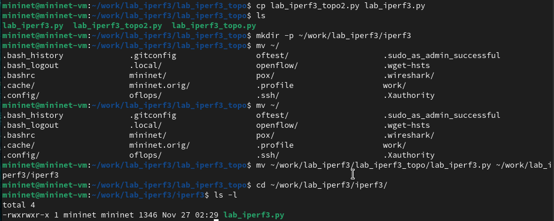{#fig:011 width=70%}


- В начале скрипта lab_iperf3.py добавила запись (рис. [-@fig:012]):

```
...
import time
...
```

- Изменила код в скрипте lab_iperf3.py так, чтобы на хостах не было ограничения по использованию ресурсов процессора и каналы между хостами и коммутатором были по 100 Мбит/с с задержкой 75 мс, без потерь, без использования ограничителей пропускной способности и максимального размера очереди (рис. [-@fig:012]).

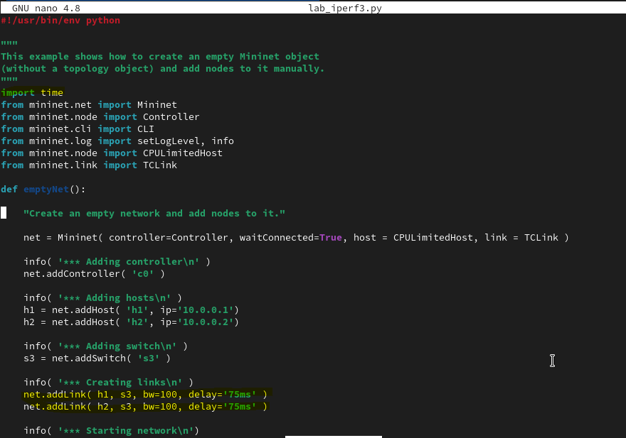{#fig:012 width=70%}

- После функции старта сети описала запуск на хосте h2 сервера iPerf3, а на хосте h1 запуск с задержкой в 10 секунд клиента iPerf3 с экспортом результатов в JSON-файл, закомментировала строки, отвечающие за запуск CLI-интерфейса (рис. [-@fig:013]): 

```
...
net.start()
info( '*** Starting network\n')

info( '*** Traffic generation\n')
h2.cmdPrint( 'iperf3 -s -D -1' )
time.sleep(10) # Wait 10 seconds for servers to start
h1.cmdPrint( 'iperf3 -c', h2.IP(), '-J > iperf_result.json' )

# info( '*** Running CLI\n' )
# CLI( net )
...
```

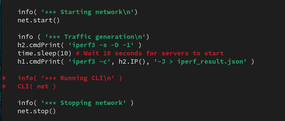{#fig:013 width=70%}

Здесь мы в фоновом режиме запускаем сервер - хост h2 с опцией -1 (только 1 клиент), и щапускаем клиент хост h1 с опцией -J, перенаправляя результаты в файл JSON.

- Запустила на отработку скрипт lab_iperf3.py (рис. [-@fig:014]):

```
sudo python lab_iperf3.py
```

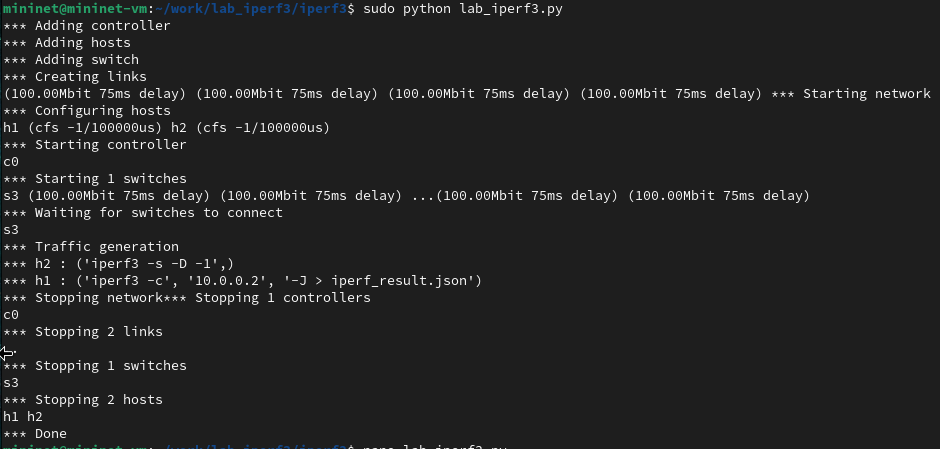{#fig:014 width=70%}

- Построила графики из получившегося  JSON-файла (рис. [-@fig:015]):

```
plot_iperf.sh iperf_result.json
```

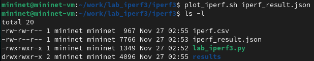{#fig:015 width=70%}

- Создала Makefile для проведения всего эксперимента:

```
touch Makefile
```

- В Makefile прописала запуск скрипта эксперимента, построение графи-
ков и очистку каталога от результатов (рис. [-@fig:016])

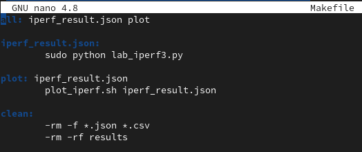{#fig:016 width=70%}

- Проверила корректность отработки Makefile (рис. [-@fig:017] и [-@fig:018]):

```
make clean
make
```

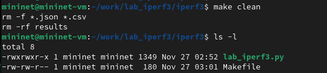{#fig:017 width=70%}

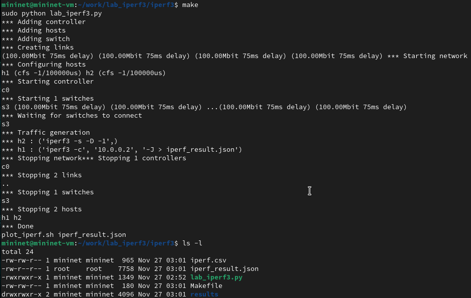{#fig:018 width=70%}

8. Завершила соединение с виртуальной машиной mininet и выключила её.

# Выводы

В ходе лабораторной работы я познакомилась с инструментом для измерения пропускной способности сети в режиме реального времени — iPerf3, а также получила навыки проведения воспроизводимого эксперимента по измерению пропускной способности моделируемой сети в среде Mininet.

