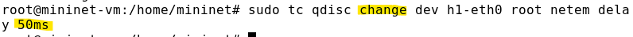

---
## Front matter
lang: ru-RU
title: Лабораторная работа №4. 
subtitle: Эмуляция и измерение задержек в глобальных сетях
author:
  - Тазаева А. А.
institute:
  - Российский университет дружбы народов, Москва, Россия

## i18n babel
babel-lang: russian
babel-otherlangs: english

## Formatting pdf
toc: false
toc-title: Содержание
slide_level: 2
aspectratio: 169
section-titles: true
theme: metropolis
header-includes:
 - \metroset{progressbar=frametitle,sectionpage=progressbar,numbering=fraction}
---

# Цель работы

Основной целью работы является знакомство с NETEM — инструментом для тестирования производительности приложений в виртуальной сети, а также получение навыков проведения интерактивного и воспроизводимого экспериментов по измерению задержки и её дрожания (jitter) в моделируемой сети в среде Mininet.

# Задания

1. Задайте простейшую топологию, состоящую из двух хостов и коммутатора с назначенной по умолчанию mininet сетью 10.0.0.0/8.
2. Проведите интерактивные эксперименты по добавлению/изменению задержки, джиттера, значения корреляции для джиттера и задержки, распределения времени задержки в эмулируемой глобальной сети.
3. Реализуйте воспроизводимый эксперимент по заданию значения задержки в эмулируемой глобальной сети. Постройте график.
4. Самостоятельно реализуйте воспроизводимые эксперименты по изменению задержки, джиттера, значения корреляции для джиттера и задержки, распределения времени задержки в эмулируемой глобальной сети. Постройте графики.

## Запуск лабораторной топологии

{#fig:003 width=70%}

## Добавление/изменение задержки в эмулируемой глобальной сети

{#fig:007 width=70%}

## Добавление/изменение задержки в эмулируемой глобальной сети

{#fig:011 width=70%}

## Добавление/изменение задержки в эмулируемой глобальной сети

{#fig:013 width=70%}

## Восстановление исходных значений (удаление правил) задержки в эмулируемой глобальной сети

{#fig:014 width=70%}

## Добавление значения дрожания задержки в интерфейс подключения к эмулируемой глобальной сети

{#fig:017 width=70%}

## Добавление значения корреляции для джиттера и задержки в интерфейс подключения к эмулируемой глобальной сети

{#fig:020 width=70%}

## Распределение задержки в интерфейсе подключения к эмулируемой глобальной сети

{#fig:022 width=70%}

## Воспроизведение экспериментов

{#fig:028 width=70%}

## Воспроизведение экспериментов

{#fig:029 width=70%}

## Воспроизведение экспериментов

{#fig:030 width=70%}

## Воспроизведение экспериментов

{#fig:034 width=70%}

## Воспроизведение экспериментов

{#fig:035 width=70%}

# Выводы по проделанной работе

Познакомилась с NETEM — инструментом для тестирования производительности приложений в виртуальной сети, а также получила навыков проведения интерактивного и воспроизводимого экспериментов по измерению задержки и её дрожания (jitter) в моделируемой сети в среде Mininet.

