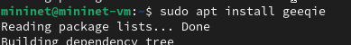

---
## Front matter
title: "Лабораторная работа №4"
subtitle: "Эмуляция и измерение задержек в глобальных сетях"
author: "Тазаева Анастасия Анатольевна"

## Generic otions
lang: ru-RU
toc-title: "Содержание"

## Bibliography
bibliography: bib/cite.bib
csl: pandoc/csl/gost-r-7-0-5-2008-numeric.csl

## Pdf output format
toc: true # Table of contents
toc-depth: 2
lof: true # List of figures
lot: true # List of tables
fontsize: 12pt
linestretch: 1.5
papersize: a4
documentclass: scrreprt
## I18n polyglossia
polyglossia-lang:
  name: russian
  options:
	- spelling=modern
	- babelshorthands=true
polyglossia-otherlangs:
  name: english
## I18n babel
babel-lang: russian
babel-otherlangs: english
## Fonts
mainfont: IBM Plex Serif
romanfont: IBM Plex Serif
sansfont: IBM Plex Sans
monofont: IBM Plex Mono
mathfont: STIX Two Math
mainfontoptions: Ligatures=Common,Ligatures=TeX,Scale=0.94
romanfontoptions: Ligatures=Common,Ligatures=TeX,Scale=0.94
sansfontoptions: Ligatures=Common,Ligatures=TeX,Scale=MatchLowercase,Scale=0.94
monofontoptions: Scale=MatchLowercase,Scale=0.94,FakeStretch=0.9
mathfontoptions:
## Biblatex
biblatex: true
biblio-style: "gost-numeric"
biblatexoptions:
  - parentracker=true
  - backend=biber
  - hyperref=auto
  - language=auto
  - autolang=other*
  - citestyle=gost-numeric
## Pandoc-crossref LaTeX customization
figureTitle: "Рис."
tableTitle: "Таблица"
listingTitle: "Листинг"
lofTitle: "Список иллюстраций"
lotTitle: "Список таблиц"
lolTitle: "Листинги"
## Misc options
indent: true
header-includes:
  - \usepackage{indentfirst}
  - \usepackage{float} # keep figures where there are in the text
  - \floatplacement{figure}{H} # keep figures where there are in the text
---

# Цель работы

Основной целью работы является знакомство с NETEM — инструментом для тестирования производительности приложений в виртуальной сети, а также получение навыков проведения интерактивного и воспроизводимого экспериментов по измерению задержки и её дрожания (jitter) в моделируемой сети в среде Mininet.

# Задание

1. Задайте простейшую топологию, состоящую из двух хостов и коммутатора с назначенной по умолчанию mininet сетью 10.0.0.0/8.
2. Проведите интерактивные эксперименты по добавлению/изменению задержки, джиттера, значения корреляции для джиттера и задержки, распределения времени задержки в эмулируемой глобальной сети.
3. Реализуйте воспроизводимый эксперимент по заданию значения задержки в эмулируемой глобальной сети. Постройте график.
4. Самостоятельно реализуйте воспроизводимые эксперименты по изменению задержки, джиттера, значения корреляции для джиттера и задержки, распределения времени задержки в эмулируемой глобальной сети. Постройте графики.

# Выполнение лабораторной работы

## Запуск лабораторной топологии

1. Запустила виртуальную среду с mininet. Из основной ОС подключилась к виртуальной машине (рис. [-@fig:001]).

{#fig:001 width=70%}

2. Исправила права запуска X-соединения (рис. [-@fig:002]).

{#fig:002 width=70%}

3. Создала простейшую тополонию, состоящую из двух хостов и коммутатора с назначенной по умолчанию mininet сетью 10.0.0.0/8 (рис. [-@fig:003]). Терминалы коммутатора и контроллера закрыла.
```
sudo mn --topo=single,2 -x
```

{#fig:003 width=70%}

4. На хостах h1 и h2 ввела команду ifconfig (рис. [-@fig:004] и [-@fig:005]), чтобы отобразить информацию, относящуюся к их сетевым интерфейсам и назначенным им IP-адресам. В дальнейшем при работе с NETEM и командой tc будут использоваться интерфейсы h1-eth0 и h2-eth0 .

{#fig:004 width=70%}

{#fig:005 width=70%}

5. Проверила подключение между хостами h1 и h2 с помощью команды ping с параметром -c 6 (рис. [-@fig:006]).

{#fig:006 width=70%}

6. Минимальное(=0.035 ms), среднее(=0.125 ms), максимальное(=0.529 ms) и стандартное(=0.180 ms) отклонение времени приёма-передачи (RTT).

## Интерактивные эксперименты

### Добавление/изменение задержки в эмулируемой глобальной сети

1. На хосте h1 добавила задержку в 100 мс к выходному интерфейсу (рис. [-@fig:007]):
```
sudo tc qdisc add dev h1-eth0 root netem delay 100ms
```

{#fig:007 width=70%}

Здесь:
- sudo : выполнить команду с более высокими привилегиями;
- tc : вызвать управление трафиком Linux;
- qdisc : изменить дисциплину очередей сетевого планировщика;
- add : создать новое правило;
- dev h1-eth0 : указать интерфейс, на котором будет применяться правило;
- netem : использовать эмулятор сети;
- delay 100ms : задержка ввода 100 мс.

2. Проверила, что соединение от хоста h1 к хосту h2 имеет задержку 100 мс, используя команду ping с параметром -c 6 с хоста h1 . Минимальное(=100.221 ms), среднее(=100.647 ms), максимальное(=101.032 ms) и стандартное(=0.329 ms) отклонение времени приёма-передачи (RTT) (рис. [-@fig:008]).

{#fig:008 width=70%}

3. Для эмуляции глобальной сети с двунаправленной задержкой необходимо к соответствующему интерфейсу на хосте h2 также добавить задержку в 100 миллисекунд (рис. [-@fig:009]):
```
sudo tc qdisc add dev h2-eth0 root netem delay 100ms
```

{#fig:009 width=70%}


4. Проверила, что соединение между хостом h1 и хостом h2 имеет RTT в 200 мс (100 мс от хоста h1 к хосту h2 и 100 мс от хоста h2 к хосту h1 ), повторив команду ping с параметром -c 6 на терминале хоста h1 . Минимальное(=200.238 ms), среднее(=200.904 ms), максимальное(=201.980 ms) и стандартное(=0.632 ms) отклонение времени приёма-передачи (RTT) (рис. [-@fig:010]).

{#fig:010 width=70%}

### Изменение задержки в эмулируемой глобальной сети

1. Изменила задержку со 100 мс до 50 мс для отправителя h1 (рис. [-@fig:011]):
```
sudo tc qdisc change dev h1-eth0 root netem delay 50ms
```
и для получателя h2 (рис. [-@fig:012]):
```
sudo tc qdisc change dev h2-eth0 root netem delay 50ms
```

{#fig:011 width=70%}

{#fig:012 width=70%}

2. Проверила, что соединение от хоста h1 к хосту h2 имеет задержку 100 мс, используя команду ping с параметром -c 6 с терминала хоста h1 . На (рис. [-@fig:013]) выделила минимальное, среднее, макси-мальное и стандартное отклонение времени приёма-передачи (RTT).

{#fig:013 width=70%}

##Восстановление исходных значений (удаление правил) задержки в эмулируемой глобальной сети# 

1. Восстановила конфигурацию по умолчанию, удалив все правила, применённые к сетевому планировщику соответствующего интерфейса. Для
отправителя h1 (рис. [-@fig:014]):
```
sudo tc qdisc del dev h1-eth0 root netem
```
Для получателя h2 (рис. [-@fig:015]):
```
sudo tc qdisc del dev h2-eth0 root netem
```

{#fig:014 width=70%}

{#fig:015 width=70%}

2. Проверила, что соединение между хостом h1 и хостом h2 не имеет явноустановленной задержки, используя команду ping с параметром -c 6 с терминала хоста h1. На (рис. [-@fig:016]) выделила минимальное, среднее, макси-мальное и стандартное отклонение времени приёма-передачи (RTT).

{#fig:016 width=70%}

### Добавление значения дрожания задержки в интерфейс подключения к эмулируемой глобальной сети

1. Добавила на узле h1 задержку в 100 мс со случайным отклонением 10 мс (рис. [-@fig:017]):
```
sudo tc qdisc add dev h1-eth0 root netem delay 100ms 10ms
```

{#fig:017 width=70%}

2. Проверила, что соединение от хоста h1 к хосту h2 имеет задержку 100 мс со случайным отклонением ±10 мс, используя в терминале хоста h1 команду ping с параметром -c 6 . На (рис. [-@fig:018]) видно минимальное, среднее, максимальное и стандартное отклонение времени приёма-передачи (RTT).

{#fig:018 width=70%}

3. Восстановила конфигурацию интерфейса по умолчанию на узле h1 (рис. [-@fig:019]).

{#fig:019 width=70%}

### Добавление значения корреляции для джиттера и задержки в интерфейс подключения к эмулируемой глобальной сети

1. Добавила на интерфейсе хоста h1 задержку в 100 мс с вариацией ±10 мс и значением корреляции в 25% (рис. [-@fig:020]):
```
sudo tc qdisc add dev h1-eth0 root netem delay 100ms 10ms 25%
```

{#fig:020 width=70%}

2. Убедилась, что все пакеты, покидающие устройство h1 на интерфейсе h1-eth0 , будут иметь время задержки 100 мс со случайным отклонением ±10 мс, при этом время передачи следующего пакета зависит от предыдущего значения на 25%. Используйте для этого в терминале хоста h1 команду ping с параметром -c 20 . На (рис. [-@fig:021]) видно минимальное, среднее, максимальное и стандартное отклонение времени приёма-передачи (RTT).

{#fig:021 width=70%}

3. Восстановила конфигурацию интерфейса по умолчанию на узле h1.

### Распределение задержки в интерфейсе подключения к эмулируемой глобальной сети

NETEM позволяет пользователю указать распределение, которое описывает, как задержки изменяются в сети. В реальных сетях передачи данных задержки неравномерны, поэтому при моделировании может быть удобно использовать некоторое случайное распределение, например, нормальное, парето или парето-нормальное.

1. Задала нормальное распределение задержки на узле h1 в эмулируемой сети (рис. [-@fig:022]):
```
sudo tc qdisc add dev h1-eth0 root netem delay 100ms 20ms distribution normal
```

{#fig:022 width=70%}

2. Убедилась, что все пакеты, покидающие хост h1 на интерфейсе h1-eth0 , будут иметь время задержки, которое распределено в диапазоне 100 мс ±20 мс. Используйте для этого команду ping на терминале хоста h1 с параметром -c 10 (рис. [-@fig:023]).

{#fig:023 width=70%}

3. Восстановила конфигурацию интерфейса по умолчанию на узле h1 и завершила работу mininet в интерактивном режиме.

## Воспроизведение экспериментов

### Предварительная подготовка

1. Обновила репозитории программного обеспечения на виртуальной машине (рис. [-@fig:024]):
```
sudo apt-get update
```

{#fig:024 width=70%}

2. Установила пакет geeqie — понадобится для просмотра файлов png (рис. [-@fig:025]):
```
sudo apt install geeqie
```

{#fig:025 width=70%}

3. Для каждого воспроизводимого эксперимента expname создала свой каталог, в котором будут размещаться файлы эксперимента (рис. [-@fig:026]):
```
mkdir -p ~/work/lab_netem_i/expname
```

{#fig:026 width=70%}

### Добавление задержки для интерфейса, подключающегося к эмулируемой глобальной сети

С помощью API Mininet воспроизвела эксперимент по добавлению задержки для интерфейса хоста, подключающегося к эмулируемой глобальной сети.

1. В виртуальной среде mininet в своём рабочем каталоге с проектами создала каталог simple-delay и перешла в него (рис. [-@fig:027]):
```
mkdir -p ~/work/lab_netem_i/simple-delay
cd ~/work/lab_netem_i/simple-delay
```

{#fig:027 width=70%}

2. Создала скрипт для эксперимента `lab_netem_i.py` (рис. [-@fig:028] и [-@fig:029]).

{#fig:028 width=70%}

{#fig:029 width=70%}

- В каких строках скрипта задается значение задержки для интерфейса хоста?  
```h1.cmdPrint( 'tc qdisc add dev h1-eth0 root netem delay 100ms' )
h2.cmdPrint( 'tc qdisc add dev h2-eth0 root netem delay 100ms' )
```
- Каким образом формируется файл с результатами эксперимента для последующего построения графиков?
```
h1.cmdPrint( 'ping -c 100', h2.IP(), '| grep "time=" | awk \'{print $5, $7}\' | sed -e \'s/time=//g\' -e \'s/icmp_seq=//g\' > ping.dat' )
```

4. Создала скрипт для визуализации ping_plot результатов эксперимента (рис. [-@fig:030]).

{#fig:030 width=70%}

5. Задала права доступа к файлу скрипта (рис. [-@fig:031]).

{#fig:031 width=70%}

6. Создала Makefile для управления процессом проведения эксперимента (рис. [-@fig:032]).

{#fig:032 width=70%}

7. Выполнила эксперимент (рис. [-@fig:033]).
```
make
```

{#fig:033 width=70%}

8. Получился следущий график (рис. [-@fig:034]).

{#fig:034 width=70%}

9. Из файла ping.dat удалила первую строку и заново построила график (рис. [-@fig:035]): 
```
make ping.png
```


{#fig:035 width=70%}

10. Разработала скрипт для вычисления на основе данных файла ping.dat минимального, среднего, максимального и стандартного отклонения времени (рис. [-@fig:036] и [-@fig:038]) и изменила файл Makefile (рис. [-@fig:037]).

{#fig:036 width=70%}

{#fig:037 width=70%}

{#fig:038 width=70%}

12. Очистила каталог от результатов проведения экспериментов:
```
make clean
```

# Выводы

Познакомилась с NETEM — инструментом для тестирования производительности приложений в виртуальной сети, а также получила навыков проведения интерактивного и воспроизводимого экспериментов по измерению задержки и её дрожания (jitter) в моделируемой сети в среде Mininet.

