---
## Front matter
lang: ru-RU
title: Лабораторная работа №5. 
subtitle: Эмуляция и измерение потерь пакетов в глобальных сетях
author:
  - Тазаева А. А.
institute:
  - Российский университет дружбы народов, Москва, Россия

## i18n babel
babel-lang: russian
babel-otherlangs: english

## Formatting pdf
toc: false
toc-title: Содержание
slide_level: 2
aspectratio: 169
section-titles: true
theme: metropolis
header-includes:
 - \metroset{progressbar=frametitle,sectionpage=progressbar,numbering=fraction}
---

# Цель работы

Освоить моделирование следующих параметров сети: потеря пакетов, дублирование пакетов, изменение порядка и повреждение пакетов.

# Задания

1. Задайте простейшую топологию, состоящую из двух хостов и коммутатора с назначенной по умолчанию mininet сетью 10.0.0.0/8.
2. Проведите интерактивные эксперименты по по исследованию параметров сети, связанных с потерей, дублированием, изменением порядка и повреждением пакетов при передаче данных.
3. Реализуйте воспроизводимый эксперимент по добавлению правила отбрасывания пакетов в эмулируемой глобальной сети. На экран выведите сводную информацию о потерянных пакетах.
4. Самостоятельно реализуйте воспроизводимые эксперименты по иссле-
дованию параметров сети, связанных с потерей, изменением порядка и повреждением пакетов при передаче данных. На экран выведите сводную информацию о потерянных пакетах.

## Запуск лабораторной топологии

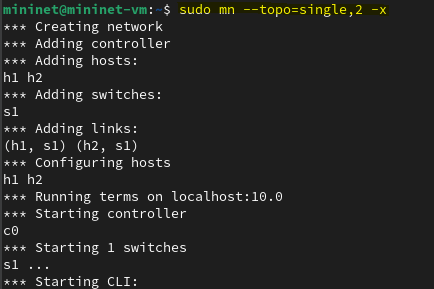{#fig:002 width=70%}

## Добавление потери пакетов на интерфейс, подключённый к эмулируемой глобальной сети

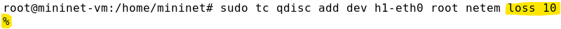{#fig:006 width=70%}

## Добавление потери пакетов на интерфейс, подключённый к эмулируемой глобальной сети

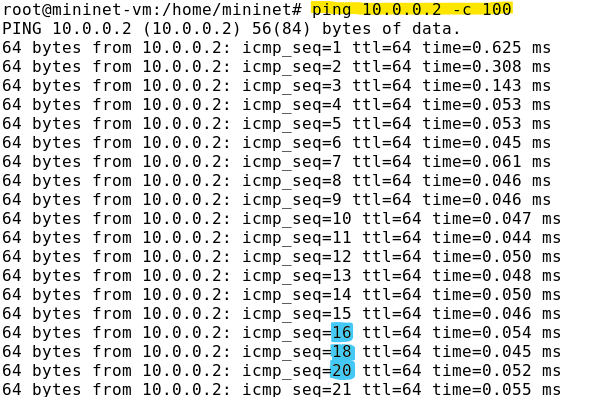{#fig:007 width=70%}

## Добавление потери пакетов на интерфейс, подключённый к эмулируемой глобальной сети

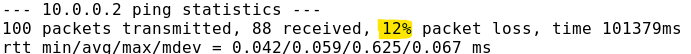{#fig:008 width=70%}

## Добавление значения корреляции для потери пакетов в эмулируемой глобальной сети

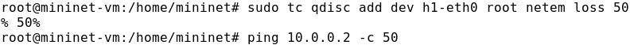{#fig:014 width=70%}

## Добавление значения корреляции для потери пакетов в эмулируемой глобальной сети

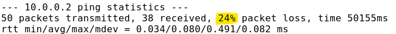{#fig:015 width=70%}

## Добавление повреждения пакетов в эмулируемой глобальной сети

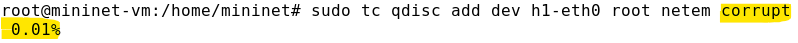{#fig:016 width=70%}

## Добавление повреждения пакетов в эмулируемой глобальной сети

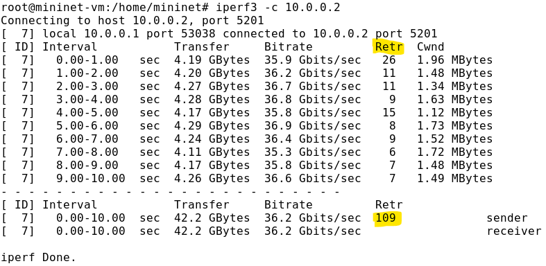{#fig:018 width=70%}

## Добавление переупорядочивания пакетов в интерфейс подключения к эмулируемой глобальной сети

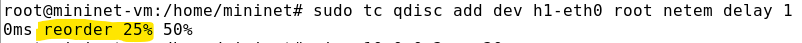{#fig:019 width=70%}

## Добавление переупорядочивания пакетов в интерфейс подключения к эмулируемой глобальной сети

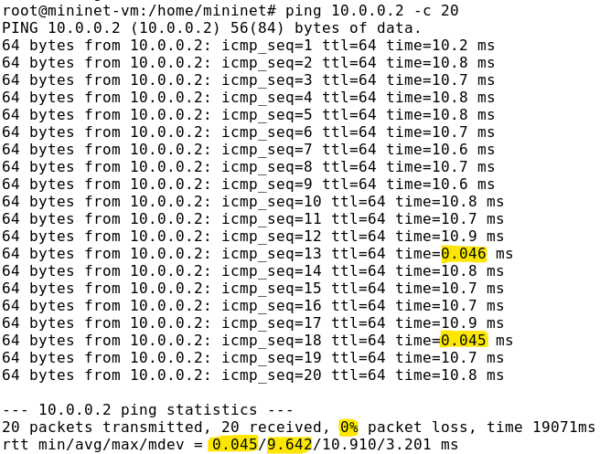{#fig:020 width=70%}

## Добавление дублирования пакетов в интерфейс подключения к эмулируемой глобальной сети

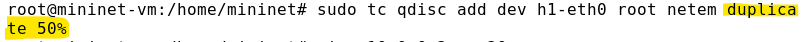{#fig:021 width=70%}

## Добавление дублирования пакетов в интерфейс подключения к эмулируемой глобальной сети

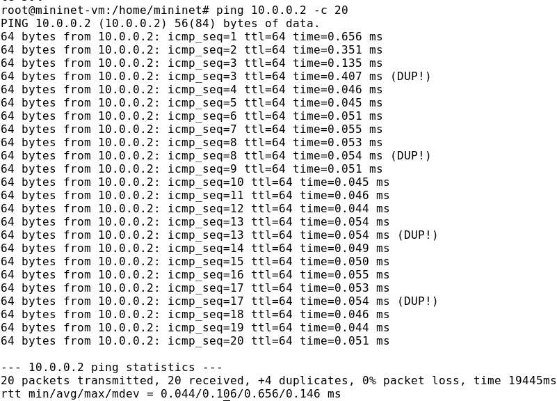{#fig:022 width=70%}

## Воспроизведение экспериментов

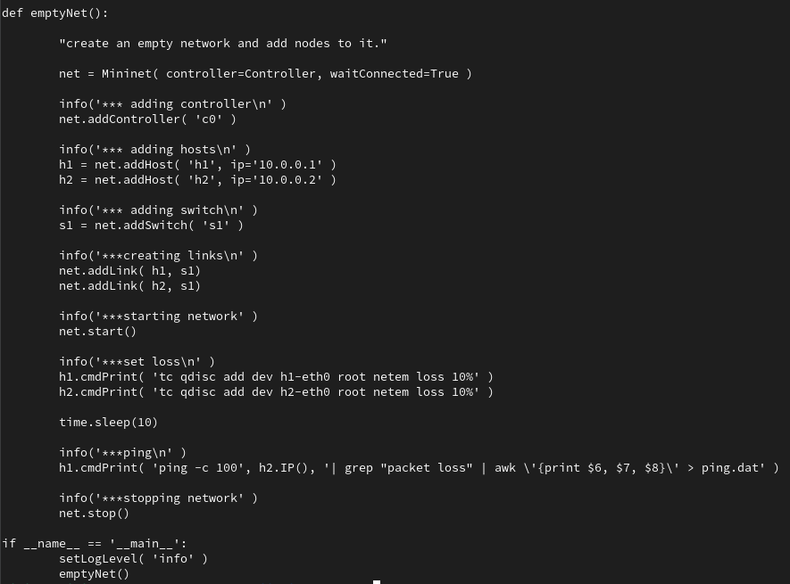{#fig:024 width=70%}

## Воспроизведение экспериментов

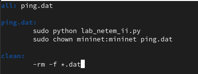{#fig:025 width=70%}

## Воспроизведение экспериментов

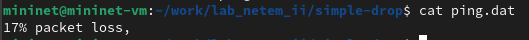{#fig:027 width=70%}

# Выводы по проделанной работе

В ходе лабораторной работы мною было освоено моделирование следующих параметров сети: потеря пакетов, дублирование пакетов, изменение порядка и повреждение пакетов.

