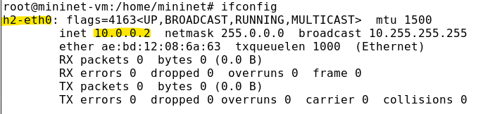

---
## Front matter
title: "Лабораторная работа №5"
subtitle: "Эмуляция и измерение потерь пакетов в глобальных сетяx"
author: "Тазаева Анастасия Анатольевна"

## Generic otions
lang: ru-RU
toc-title: "Содержание"

## Bibliography
bibliography: bib/cite.bib
csl: pandoc/csl/gost-r-7-0-5-2008-numeric.csl

## Pdf output format
toc: true # Table of contents
toc-depth: 2
lof: true # List of figures
lot: true # List of tables
fontsize: 12pt
linestretch: 1.5
papersize: a4
documentclass: scrreprt
## I18n polyglossia
polyglossia-lang:
  name: russian
  options:
	- spelling=modern
	- babelshorthands=true
polyglossia-otherlangs:
  name: english
## I18n babel
babel-lang: russian
babel-otherlangs: english
## Fonts
mainfont: IBM Plex Serif
romanfont: IBM Plex Serif
sansfont: IBM Plex Sans
monofont: IBM Plex Mono
mathfont: STIX Two Math
mainfontoptions: Ligatures=Common,Ligatures=TeX,Scale=0.94
romanfontoptions: Ligatures=Common,Ligatures=TeX,Scale=0.94
sansfontoptions: Ligatures=Common,Ligatures=TeX,Scale=MatchLowercase,Scale=0.94
monofontoptions: Scale=MatchLowercase,Scale=0.94,FakeStretch=0.9
mathfontoptions:
## Biblatex
biblatex: true
biblio-style: "gost-numeric"
biblatexoptions:
  - parentracker=true
  - backend=biber
  - hyperref=auto
  - language=auto
  - autolang=other*
  - citestyle=gost-numeric
## Pandoc-crossref LaTeX customization
figureTitle: "Рис."
tableTitle: "Таблица"
listingTitle: "Листинг"
lofTitle: "Список иллюстраций"
lotTitle: "Список таблиц"
lolTitle: "Листинги"
## Misc options
indent: true
header-includes:
  - \usepackage{indentfirst}
  - \usepackage{float} # keep figures where there are in the text
  - \floatplacement{figure}{H} # keep figures where there are in the text
---

# Цель работы

Освоить моделирование следующих параметров сети: потеря пакетов, дублирование пакетов, изменение порядка и повреждение пакетов.

# Задание

1. Задайте простейшую топологию, состоящую из двух хостов и коммутатора с назначенной по умолчанию mininet сетью 10.0.0.0/8.
2. Проведите интерактивные эксперименты по по исследованию параметров сети, связанных с потерей, дублированием, изменением порядка и повреждением пакетов при передаче данных.
3. Реализуйте воспроизводимый эксперимент по добавлению правила отбрасывания пакетов в эмулируемой глобальной сети. На экран выведите сводную информацию о потерянных пакетах.
4. Самостоятельно реализуйте воспроизводимые эксперименты по иссле-
дованию параметров сети, связанных с потерей, изменением порядка и повреждением пакетов при передаче данных. На экран выведите сводную информацию о потерянных пакетах.


# Выполнение лабораторной работы

## Запуск лабораторной топологии

1. Запустила виртуальную среду с mininet. Из основной ОС подключилась к виртуальной машине (рис. [-@fig:001]). Исправила права запуска X-соединения (рис. [-@fig:001])

{#fig:001 width=70%}

2. Создала простейшую тополонию, состоящую из двух хостов и коммутатора с назначенной по умолчанию mininet сетью 10.0.0.0/8 (рис. [-@fig:002]). Терминалы коммутатора и контроллера закрыла.

```
sudo mn --topo=single,2 -x
```

{#fig:002 width=70%}

3. На хостах h1 и h2 ввела команду ifconfig (рис. [-@fig:003] и [-@fig:004]), чтобы отобразить информацию, относящуюся к их сетевым интерфейсам и назначенным им IP-адресам. В дальнейшем при работе с NETEM и командой tc будут использоваться интерфейсы h1-eth0 и h2-eth0 .

{#fig:003 width=70%}

{#fig:004 width=70%}

4. Проверила подключение между хостами h1 и h2 с помощью команды ping с параметром -c 6 (рис. [-@fig:005]). На этом же рисунке выделила цветом значения всеъ возможных отклонений времени приёма-передачи.

{#fig:005 width=70%}

## Интерактивные эксперименты

### Добавление потери пакетов на интерфейс, подключённый к эмулируемой глобальной сети

1. На хосте h1 добавила 10% потерь пакетов к интерфейсу h1-eth0 (рис. [-@fig:006]):
```
sudo tc qdisc add dev h1-eth0 root netem delay loss 10%
```

{#fig:006 width=70%}

Здесь:
- sudo : выполнить команду с более высокими привилегиями;
- tc : вызвать управление трафиком Linux;
- qdisc : изменить дисциплину очередей сетевого планировщика;
- add : создать новое правило;
- dev h1-eth0 : указать интерфейс, на котором будет применяться правило;
- netem : использовать эмулятор сети;
- loss 10% : 10% потерь пакетов.

2. Проверила, что на соединении от хоста h1 к хосту h2 имеются потери пакетов, используя команду ping с параметром -c 100 с хоста h1 (рис. [-@fig:007]). Некоторые номера оследовательности отсутствуют из-за потери пакетов - выделены синим (рис. [-@fig:007]). В сводном отчёте ping сообщает о проценте потерянных пакетов после завершения передачи - 12% потерянных пакетов (рис. [-@fig:008]).

{#fig:007 width=70%}

{#fig:008 width=70%}

3. Для эмуляции глобальной сети с потерей пакетов в обоих направлениях необходимо к соответствующему интерфейсу на хосте h2 также добавить 10% потерь пакетов (рис. [-@fig:009]):
```
sudo tc qdisc add dev h2-eth0 root netem loss 10%
```

{#fig:009 width=70%}


4. Проверила, что соединение между хостом h1 и хостом h2 имеет больший процент потерянных данных (10% от хоста h1 к хосту h2 и 10% от хоста h2 к хосту h1 ), повторив команду ping с параметром -c 100 на терминале хоста h1 (рис. [-@fig:010]). Отсутствующие из-за потери пакетов номера последовательности (4, 13, 18, 24, 27, 28, 34, 36, 45, 59,67, 72, 74, 77, 96, 100), процент потерянных пакетов после завершения передачи - 16%. 

{#fig:010 width=70%}

5. Восстановила конфигурацию по умолчанию, удалив все правила, применённые к сетевому планировщику соответствующего интерфейса. Для
отправителя h1 (рис. [-@fig:011]):
```
sudo tc qdisc del dev h1-eth0 root netem
```
Для получателя h2 (рис. [-@fig:012]):
```
sudo tc qdisc del dev h2-eth0 root netem
```

{#fig:011 width=70%}

{#fig:012 width=70%}

6. Проверила, что соединение между хостом h1 и хостом h2 не имеет явноустановленной задержки, используя команду ping с параметром -c 6 с терминала хоста h1 (рис. [-@fig:013] и [-@fig:012]). 

{#fig:013 width=70%}

### Добавление значения корреляции для потери пакетов в эмулируемой глобальной сети

1. Добавила на интерфейсе узла h1 коэффициент потери пакетов 50% (такой высокий уровень потери пакетов маловероятен), и каждая последующая вероятность зависит на 50% от последней (рис. [-@fig:014]):

```
sudo tc qdisc add dev h1-eth0 root netem loss 50% 50%
```

{#fig:014 width=70%}

2. Проверила, что на соединении от хоста h1 к хосту h2 имеются потери пакетов, используя команду ping с параметром -c 50 с хоста h1 . Отсутствующие из-за потери пакетов номера последовательности (17, 27, 29, 30, 31, 32, 33, 36, 42, 43, 44, 50), процент потерянных пакетов после завершения передачи - 24% (рис. [-@fig:015]).

{#fig:015 width=70%}

3. Восстановила для узла h1 конфигурацию по умолчанию, удалив все правила, применённые к сетевому планировщику соответствующего интерфейса:

```
sudo tc qdisc del dev h1-eth0 root netem
```

### Добавление повреждения пакетов в эмулируемой глобальной сети

1. Добавила на интерфейсе узла h1 0,01% повреждения пакетов (рис. [-@fig:016]):

```
sudo tc qdisc add dev h1-eth0 root netem corrupt 0.01%
```

{#fig:016 width=70%}

2. Проверила конфигурацию с помощью инструмента iPerf3 для проверки
повторных передач. Для этого:

- запустила iPerf3 в режиме сервера в терминале хоста h2 (рис. [-@fig:017]):

```
iperf3 -s
```

- запустила iPerf3 в клиентском режиме в терминале хоста h1 (рис. [-@fig:018]):

```
iperf3 -c 10.0.0.2
```

{#fig:017 width=70%}

{#fig:018 width=70%}


- общее количество повторно переданных пакетов указано в поле Retr (рис. [-@fig:018]).

3. Восстановила для узла h1 конфигурацию по умолчанию, удалив все правила, применённые к сетевому планировщику соответствующего интерфейса.

### Добавление переупорядочивания пакетов в интерфейс подключения к эмулируемой глобальной сети

1. Добавила на интерфейсе узла h1 следующее правило (рис. [-@fig:019]):

```
sudo tc qdisc add dev h1-eth0 root netem delay 10ms reorder 25% 50%
```

Здесь 25% пакетов (со значением корреляции 50%) будут отправлены немедленно, а остальные 75% будут задержаны на 10 мс.

{#fig:019 width=70%}

2. Проверила, что на соединении от хоста h1 к хосту h2 имеются потери пакетов, используя команду ping с параметром -c 20 с хоста h1 . Часть пакетов не имеют задержки, а последующие несколько пакетов будут иметь задержку около 10 миллисекунд, выделила цветом (рис. [-@fig:020]). 

{#fig:020 width=70%}

3. Восстановила для узла h1 конфигурацию по умолчанию, удалив все правила, применённые к сетевому планировщику соответствующего интерфейса.

### Добавление дублирования пакетов в интерфейс подключения к эмулируемой глобальной сети

1. Для интерфейса узла h1 задала правило c дублированием 50% пакетов (т.е. 50% пакетов должны быть получены дважды) (рис. [-@fig:021]):

```
sudo tc qdisc add dev h1-eth0 root netem duplicate 50%
```

{#fig:021 width=70%}

2. Проверила, что на соединении от хоста h1 к хосту h2 имеются дублированные пакеты, используя команду ping с параметром -c 20 с хоста h1 (рис. [-@fig:022]). Дубликаты пакетов помечаются как DUP! . Измеренная скорость дублирования пакетов будет приближаться к настроенной скорости по мере выполнения большего количества попыток.

{#fig:022 width=70%}

3. Восстановила для узла h1 конфигурацию по умолчанию, удалив все правила, применённые к сетевому планировщику соответствующего интерфейса.

## Воспроизведение экспериментов

### Предварительная подготовка

1. Для каждого воспроизводимого эксперимента expname создала свой каталог, в котором будут размещаться файлы эксперимента (рис. [-@fig:023]):

```
mkdir -p ~/work/lab_netem_ii/expname
```

{#fig:023 width=70%}

### Добавление потери пакетов на интерфейс, подключённый к эмулируемой глобальной сети

С помощью API Mininet воспроизвела эксперимент по добавлению задержки для интерфейса хоста, подключающегося к эмулируемой глобальной сети.

1. В виртуальной среде mininet в своём рабочем каталоге с проектами создала каталог simple-drop и перешла в него. Создала скрипт для эксперимента `lab_netem_ii.py` (рис. [-@fig:024]). Скорректировала скрипт так, чтобы в отдельный файл выводилась информация о потерях пакетов.

```
#!/usr/bin/env python

"""
Simple experiment.
Output: ping.dat
"""

from mininet.net import Mininet
from mininet.node import Controller
from mininet.cli import CLI
from mininet.log import setLogLevel, info
import time

def emptyNet():

	"create an empty network and add nodes to it."

	net = Mininet( controller=Controller, waitConnected=True )

	info('*** adding controller\n' )
	net.addController( 'c0' )

	info('*** adding hosts\n' )
	h1 = net.addHost( 'h1', ip='10.0.0.1' )
	h2 = net.addHost( 'h2', ip='10.0.0.2' )

	info('*** adding switch\n' )
	s1 = net.addSwitch( 's1' )

	info('***creating links\n' )
	net.addLink( h1, s1)
	net.addLink( h2, s1)

	info('***starting network' )
	net.start()

	info('***set loss\n' )
	h1.cmdPrint( 'tc qdisc add dev h1-eth0 root netem loss 10%' )
	h2.cmdPrint( 'tc qdisc add dev h2-eth0 root netem loss 10%' )

	time.sleep(10)

	info('***ping\n' )
	h1.cmdPrint( 'ping -c 100', h2.IP(), '| grep "packet loss" | awk \'{print $6, $7, $8}\' > ping.dat' )

	info('***stopping network' )
	net.stop()

if __name__ == '__main__':
	setLogLevel( 'info' )
	emptyNet()
```

{#fig:024 width=70%}

-В каких строках скрипта задается значение потери пакетов для интерфейса хоста?

```
	h1.cmdPrint( 'tc qdisc add dev h1-eth0 root netem loss 10%' )
	h2.cmdPrint( 'tc qdisc add dev h2-eth0 root netem loss 10%' )
```

2. Создала Makefile для управления процессом проведения эксперимента (рис. [-@fig:025]).

```
all: ping.dat

ping.dat:
	sudo python lab_netem_ii.py
	sudo chown mininet:mininet ping.dat

clean:
	-rm -f *.dat
```

{#fig:025 width=70%}

3. Выполнила эксперимент (рис. [-@fig:026]).
```
make
```

{#fig:026 width=70%}

4. В файл ping.dat вывелась информация о потерянных пакетах в % (рис. [-@fig:027]).

{#fig:027 width=70%}

5. Очистила каталог от результатов проведения экспериментов:

```
make clean
```
## Самостоятельная работа 

### Добавление дублирования пакетов в интерфейс подключения к эмулируемой глобальной сети

1. Создала скрипт `/dup/lab_netem_ii.py`:

```
#!/usr/bin/env python

"""
Simple experiment.
Output: ping.dat
"""

from mininet.net import Mininet
from mininet.node import Controller
from mininet.cli import CLI
from mininet.log import setLogLevel, info
import time

def emptyNet():

	"create an empty network and add nodes to it."

	net = Mininet( controller=Controller, waitConnected=True )

	info('*** adding controller\n' )
	net.addController( 'c0' )

	info('*** adding hosts\n' )
	h1 = net.addHost( 'h1', ip='10.0.0.1' )
	h2 = net.addHost( 'h2', ip='10.0.0.2' )

	info('*** adding switch\n' )
	s1 = net.addSwitch( 's1' )

	info('***creating links\n' )
	net.addLink( h1, s1)
	net.addLink( h2, s1)

	info('***starting network' )
	net.start()

	info('***set loss\n' )
	h1.cmdPrint( 'tc qdisc add dev h1-eth0 root netem duplicate 50%' )

	time.sleep(10)

	info('***ping\n' )
	h1.cmdPrint( 'ping -c 100', h2.IP(), '| grep "duplicates" | awk \'{print "for ", $1, $2, " - ",  $6, "duplacates"}\' > ping.dat' )

	info('***stopping network' )
	net.stop()

if __name__ == '__main__':
	setLogLevel( 'info' )
	emptyNet()
```

2. Результат скрипта выводится в файл `/dup/ping.dat` (рис. [-@fig:028]).

{#fig:028 width=70%}

### Добавление повреждения пакетов в эмулируемой глобальной сети

1. Создала скрипт `/corrupt/lab_netem_ii.py`:

```
#!/usr/bin/env python

"""
Simple experiment.
Output: ping.dat
"""

from mininet.net import Mininet
from mininet.node import Controller
from mininet.cli import CLI
from mininet.log import setLogLevel, info
import time

def emptyNet():

	"create an empty network and add nodes to it."

	net = Mininet( controller=Controller, waitConnected=True )

	info('*** adding controller\n' )
	net.addController( 'c0' )

	info('*** adding hosts\n' )
	h1 = net.addHost( 'h1', ip='10.0.0.1' )
	h2 = net.addHost( 'h2', ip='10.0.0.2' )

	info('*** adding switch\n' )
	s1 = net.addSwitch( 's1' )

	info('***creating links\n' )
	net.addLink( h1, s1)
	net.addLink( h2, s1)

	info('***starting network' )
	net.start()

	info('***set loss\n' )
	h1.cmdPrint( 'tc qdisc add dev h1-eth0 root netem corrupt 0.01%' )
	time.sleep(10)

	info('***ping\n' )
	h2.cmdPrint( 'iperf3 -s -D -1' )
	time.sleep(10)
	h1.cmdPrint( 'iperf3 -c ', h2.IP(), ' -J > res.json' )

	info('***stopping network' )
	net.stop()

if __name__ == '__main__':
	setLogLevel( 'info' )
	emptyNet()
```

2. Результат скрипта выводится в файл `/corrupt/res.json`. Также получены графики, расположенные в каталоге `/dup/results` (рис. [-@fig:029]).

{#fig:029 width=70%}

# Выводы

В ходе лабораторной работы мною было освоено моделирование следующих параметров сети: потеря пакетов, дублирование пакетов, изменение порядка и повреждение пакетов.

