---
## Front matter
lang: ru-RU
title: Лабораторная работа №6. 
subtitle: Настройка пропускной способности глобальной сети с помощью Token Bucket Filter
author:
  - Тазаева А. А.
institute:
  - Российский университет дружбы народов, Москва, Россия

## i18n babel
babel-lang: russian
babel-otherlangs: english

## Formatting pdf
toc: false
toc-title: Содержание
slide_level: 2
aspectratio: 169
section-titles: true
theme: metropolis
header-includes:
 - \metroset{progressbar=frametitle,sectionpage=progressbar,numbering=fraction}
---

# Цель работы

Основной целью работы является знакомство с принципами работы дисциплины очереди Token Bucket Filter, которая формирует входящий/исходящий трафик для ограничения пропускной способности, а также получение навыков моделирования и исследования поведения трафика посредством проведения интерактивного и воспроизводимого экспериментов в Mininet.

# Задание

1. Задайте топологию (рис. 6.3), состоящую из двух хостов и двух коммутаторов с назначенной по умолчанию mininet сетью 10.0.0.0/8.

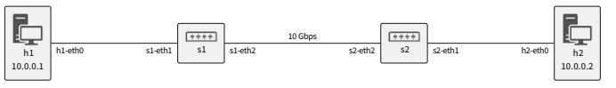{#fig:000 width=70%}

2. Проведите интерактивные эксперименты по ограничению пропускной способности сети с помощью TBF в эмулируемой глобальной сети.
3. Самостоятельно реализуйте воспроизводимые эксперимент по применению TBF для ограничения пропускной способности. Постройте соответствующие графики.

## Ограничение скорости на конечных хостах

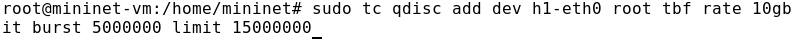{#fig:006 width=70%}

## Ограничение скорости на конечных хостах

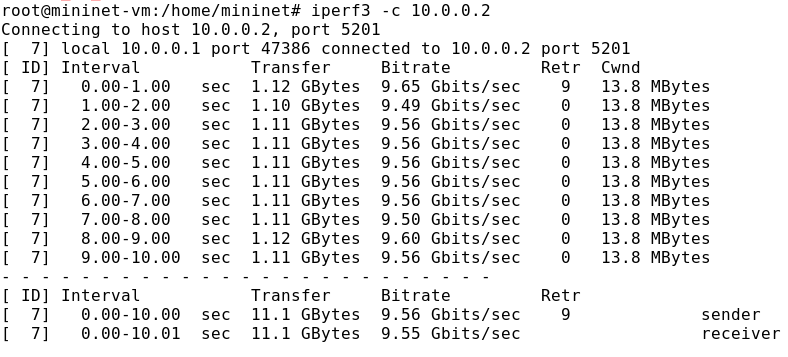{#fig:008 width=70%}

## Ограничение скорости на коммутаторах

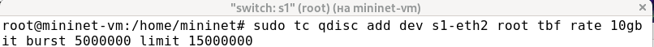{#fig:009 width=70%}

## Ограничение скорости на коммутаторах

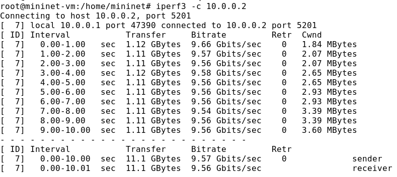{#fig:010 width=70%}

## Объединение NETEM и TBF

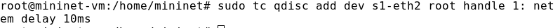{#fig:012 width=70%}

## Объединение NETEM и TBF

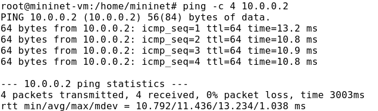{#fig:013 width=70%}

## Объединение NETEM и TBF

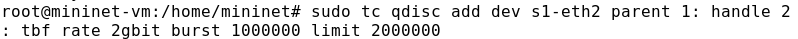{#fig:014 width=70%}

## Воспроизведение экспериментов

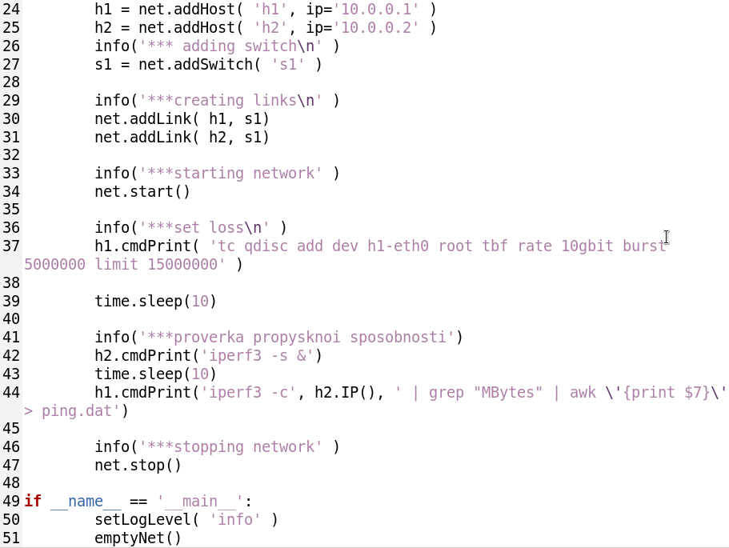{#fig:016 width=70%}

## Воспроизведение экспериментов

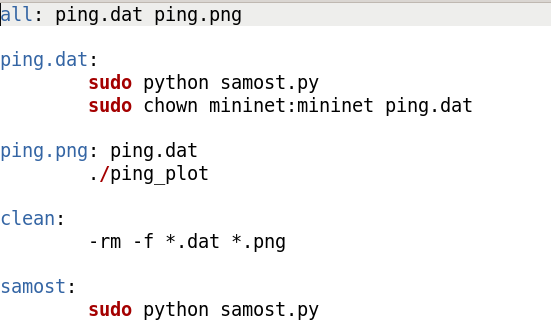{#fig:017 width=70%}

## Воспроизведение экспериментов

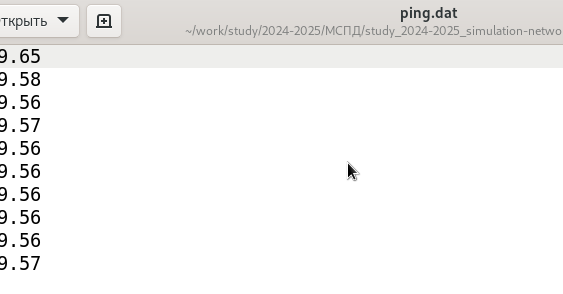{#fig:018 width=70%}

## Воспроизведение экспериментов

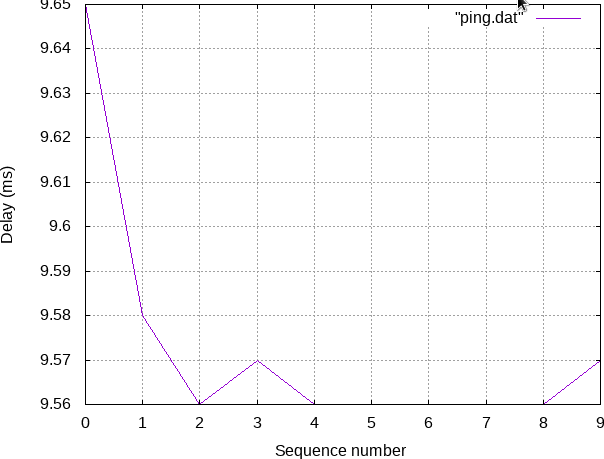{#fig:019 width=70%}

# Выводы по проделанной работе

В ходе лабораторной работы я знакомилась с принципами работы дисциплины очереди Token Bucket Filter, которая формирует входящий/исходящий трафик для ограничения пропускной способности, а также получила навыки моделирования и исследования поведения трафика посредством проведения интерактивного и воспроизводимого экспериментов в Mininet.

