---
## Front matter
title: "Лабораторная работа №6"
subtitle: "Настройка пропускной способности глобальной сети с помощью Token Bucket Filter"
author: "Тазаева Анастасия Анатольевна"

## Generic otions
lang: ru-RU
toc-title: "Содержание"

## Bibliography
bibliography: bib/cite.bib
csl: pandoc/csl/gost-r-7-0-5-2008-numeric.csl

## Pdf output format
toc: true # Table of contents
toc-depth: 2
lof: true # List of figures
lot: true # List of tables
fontsize: 12pt
linestretch: 1.5
papersize: a4
documentclass: scrreprt
## I18n polyglossia
polyglossia-lang:
  name: russian
  options:
	- spelling=modern
	- babelshorthands=true
polyglossia-otherlangs:
  name: english
## I18n babel
babel-lang: russian
babel-otherlangs: english
## Fonts
mainfont: IBM Plex Serif
romanfont: IBM Plex Serif
sansfont: IBM Plex Sans
monofont: IBM Plex Mono
mathfont: STIX Two Math
mainfontoptions: Ligatures=Common,Ligatures=TeX,Scale=0.94
romanfontoptions: Ligatures=Common,Ligatures=TeX,Scale=0.94
sansfontoptions: Ligatures=Common,Ligatures=TeX,Scale=MatchLowercase,Scale=0.94
monofontoptions: Scale=MatchLowercase,Scale=0.94,FakeStretch=0.9
mathfontoptions:
## Biblatex
biblatex: true
biblio-style: "gost-numeric"
biblatexoptions:
  - parentracker=true
  - backend=biber
  - hyperref=auto
  - language=auto
  - autolang=other*
  - citestyle=gost-numeric
## Pandoc-crossref LaTeX customization
figureTitle: "Рис."
tableTitle: "Таблица"
listingTitle: "Листинг"
lofTitle: "Список иллюстраций"
lotTitle: "Список таблиц"
lolTitle: "Листинги"
## Misc options
indent: true
header-includes:
  - \usepackage{indentfirst}
  - \usepackage{float} # keep figures where there are in the text
  - \floatplacement{figure}{H} # keep figures where there are in the text
---

# Цель работы

Основной целью работы является знакомство с принципами работы дисциплины очереди Token Bucket Filter, которая формирует входящий/исходящий трафик для ограничения пропускной способности, а также получение навыков моделирования и исследования поведения трафика посредством проведения интерактивного и воспроизводимого экспериментов в Mininet.

# Задание

1. Задайте топологию (рис. 6.3), состоящую из двух хостов и двух коммутаторов с назначенной по умолчанию mininet сетью 10.0.0.0/8.

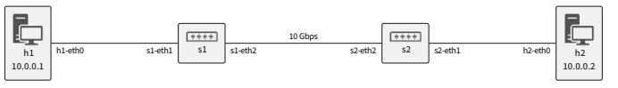{#fig:000 width=70%}

2. Проведите интерактивные эксперименты по ограничению пропускной способности сети с помощью TBF в эмулируемой глобальной сети.
3. Самостоятельно реализуйте воспроизводимые эксперимент по применению TBF для ограничения пропускной способности. Постройте соответствующие графики.


# Выполнение лабораторной работы

## Запуск лабораторной топологии

1. Запустила виртуальную среду с mininet. Из основной ОС подключилась к виртуальной машине (рис. [-@fig:001]). Исправила права запуска X-соединения (рис. [-@fig:001])

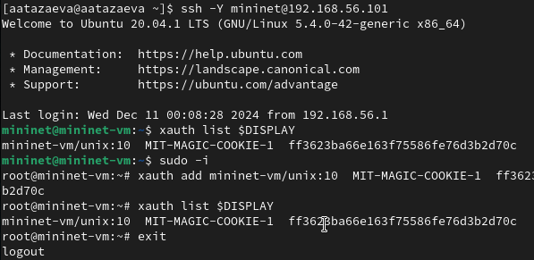{#fig:001 width=70%}

2. Создала простейшую тополонию, состоящую из двух хостов и двух коммутаторов с назначенной по умолчанию mininet сетью 10.0.0.0/8. 

```
sudo mn --topo=linear,2 -x
```

3. На хостах h1 и h2, а также на коммутаторе ввела команду ifconfig (рис. [-@fig:002] - [-@fig:004]), чтобы отобразить информацию, относящуюся к их сетевым интерфейсам и назначенным им IP-адресам. В дальнейшем при работе с NETEM и командой tc будут использоваться интерфейсы h1-eth0 и h2-eth0 .

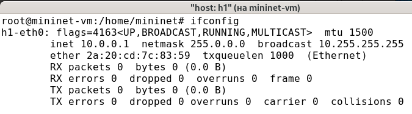{#fig:002 width=70%}

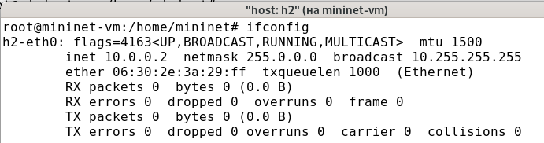{#fig:003 width=70%}

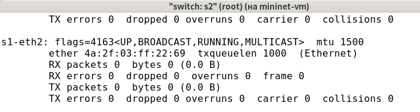{#fig:004 width=70%}

4. Проверила подключение между хостами h1 и h2 с помощью команды ping с параметром -c 4 (рис. [-@fig:005]). 

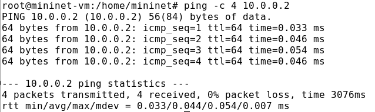{#fig:005 width=70%}

7. В терминале хоста h2 запустила iPerf3 в режиме сервера:

```
iperf3 -s
```

8. В терминале хоста h1 запустила iPerf3 в режиме клиента (рис. [-@fig:006]):

```
iperf3 -c 10.0.0.2
```

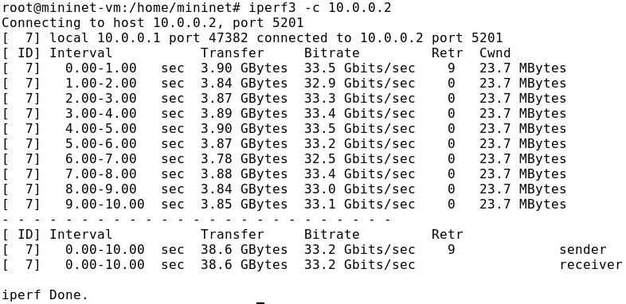{#fig:006 width=70%}

## Интерактивные эксперименты

### Ограничение скорости на конечных хостах

Команду tc можно применить к сетевому интерфейсу устройства для формирования исходящего трафика. Требуется ограничить скорость отправки данных с конечного хоста с помощью фильтра Token Bucket Filter (tbf).

1. Изменила пропускную способность хоста h1 , установив пропускную способность на 10 Гбит/с на интерфейсе h1-eth0 и параметры TBF-фильтра: (рис. [-@fig:007]):

```
sudo tc qdisc add dev h1-eth0 root tbf rate 10gbit burst 5000000 limit 15000000
```

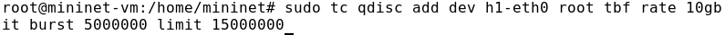{#fig:007 width=70%}

Здесь:
- sudo : включить выполнение команды с более высокими привилегиями безопасности;
- tc : вызвать управление трафиком Linux;
- qdisc : изменить дисциплину очередей сетевого планировщика;
- add (добавить): создать новое правило;
- dev h1-eth0 root : интерфейс, на котором будет применяться правило;
- tbf : использовать алгоритм Token Bucket Filter;
- rate : указать скорость передачи (10 Гбит/с);
- burst : количество байтов, которое может поместиться в корзину (5 000000);
- limit : размер очереди в байтах (15 000 000).

2. Фильтр tbf требует установки значения всплеска при ограничении скорости. Это значение должно быть достаточно высоким, чтобы обеспечить установленную скорость. Она должна быть не ниже указанной частоты, делённой на HZ, где HZ — тактовая частота, настроенная как параметр ядра, и может быть извлечена с помощью следующей команды: 

```
egrep '^CONFIG_HZ_[0-9]+' /boot/config-`uname -r`
```

Для расчёта значения всплеска (burst) необходимо скорость передачи (10 Гбит/с или 10 Gbps = 10,000,000,000 bps) разделить на полученное таким образом значение HZ (на хосте h1 HZ = 250): 
Burst = 10,000,000,000/250 = 40,000,000 bits = 40,000,000/8 bytes = 5,000,000 bytes.

3. С помощью iPerf3 проверила, что значение пропускной способности изменилось (рис. [-@fig:008])

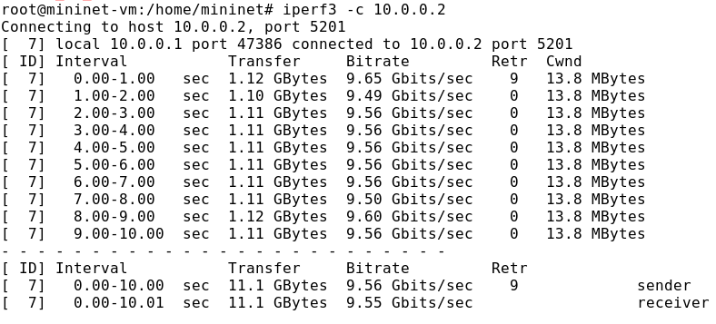{#fig:008 width=70%}

### Ограничение скорости на коммутаторах

При ограничении скорости на интерфейсе s1-eth2 коммутатора s1 все сеансы связи между коммутатором s1 и коммутатором s2 будут фильтроваться в соответствии с применяемыми правилами.

1. Применила правило ограничения скорости tbf с параметрами rate = 10gbit, burst = 5,000,000, limit = 15,000,000 к интерфейсу s1-eth2 коммутатора s1, который соединяет его с коммутатором s2 (рис. [-@fig:009]):

```
sudo tc qdisc add dev s1-eth2 root tbf rate 10gbit burst 5000000 limit 15000000
```

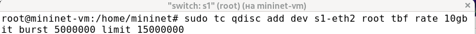{#fig:009 width=70%}

2. Проверила конфигурацию с помощью инструмента iperf3 для измерения
пропускной способности(рис. [-@fig:010]).

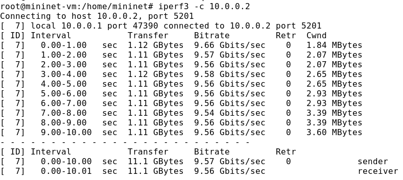{#fig:010 width=70%}

3. Удалила модифицированную конфигурацию на коммутаторе s1 (рис. [-@fig:011]).

{#fig:011 width=70%}

### Объединение NETEM и TBF

NETEM используется для изменения задержки, джиттера, повреждения пакетов и т.д. TBF может использоваться для ограничения скорости. Утилита tc позволяет комбинировать несколько модулей. При этом первая дисциплина очереди ( qdisc1 ) присоединяется к корневой метке, последующие дисциплины очереди можно прикрепить к своим родителям, указав правильную метку.

1. Объединила NETEM и TBF, введя на интерфейсе s1-eth2 коммутатора s1 задержку, джиттер, повреждение пакетов и указав скорость (рис. [-@fig:012]):

```
sudo tc qdisc add dev s1-eth2 root handle 1: netem delay 10ms
```

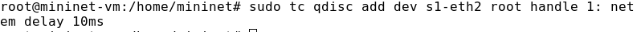{#fig:012 width=70%}

Здесь ключевое слово handle задаёт дескриптор подключения, имеющий смысл очерёдности подключения разных дисциплин qdisc .

2. Убедилась, что соединение от хоста h1 к хосту h2 имеет заданную задержку. Для этого запустила команду ping с параметром -c 4 с терминала хоста h1 (рис. [-@fig:013]).

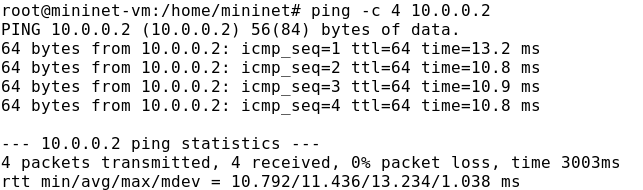{#fig:013 width=70%}

3. Добавила второе правило на коммутаторе s1 , которое задаёт ограничение скорости с помощью tbf с параметрами rate =2gbit, burst =1,000,000, limit =2,000,000 (рис. [-@fig:014]):

```
sudo tc qdisc add dev s1-eth2 parent 1: handle 2: tbf rate 2gbit burst 1000000 limit 2000000
```

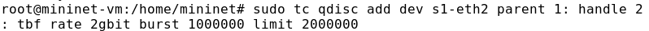{#fig:014 width=70%}

4. Проверила конфигурацию с помощью инструмента iperf3 для измерения
пропускной способности (рис. [-@fig:015]).

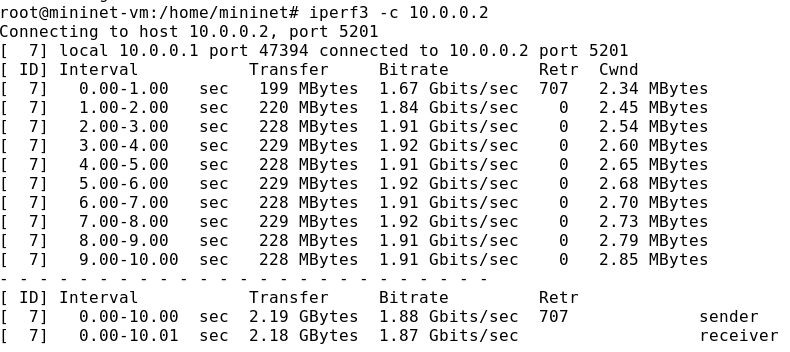{#fig:015 width=70%}

## Воспроизведение экспериментов


1. В виртуальной среде mininet в своём рабочем каталоге с проектами создала каталог tbf и перешла в него. Создала скрипт для эксперимента `samost.py` (рис. [-@fig:016]). 

```
#!/usr/bin/env python

"""
Simple experiment.
Output: ping.dat
"""

from mininet.net import Mininet
from mininet.node import Controller
from mininet.cli import CLI
from mininet.log import setLogLevel, info
import time

def emptyNet():

	"create an empty network and add nodes to it."

	net = Mininet( controller=Controller, waitConnected=True )

	info('*** adding controller\n' )
	net.addController( 'c0' )

	info('*** adding hosts\n' )
	h1 = net.addHost( 'h1', ip='10.0.0.1' )
	h2 = net.addHost( 'h2', ip='10.0.0.2' )
	info('*** adding switch\n' )
	s1 = net.addSwitch( 's1' )

	info('***creating links\n' )
	net.addLink( h1, s1)
	net.addLink( h2, s1)

	info('***starting network' )
	net.start()

	info('***set loss\n' )
	h1.cmdPrint( 'tc qdisc add dev h1-eth0 root tbf rate 10gbit burst 5000000 limit 15000000' )
	
	time.sleep(10)

	info('***proverka propysknoi sposobnosti')
	h2.cmdPrint('iperf3 -s &')
	time.sleep(10)
	h1.cmdPrint('iperf3 -c', h2.IP(), ' | grep "MBytes" | awk \'{print $7}\' > ping.dat')

	info('***stopping network' )
	net.stop()

if __name__ == '__main__':
	setLogLevel( 'info' )
	emptyNet()
```

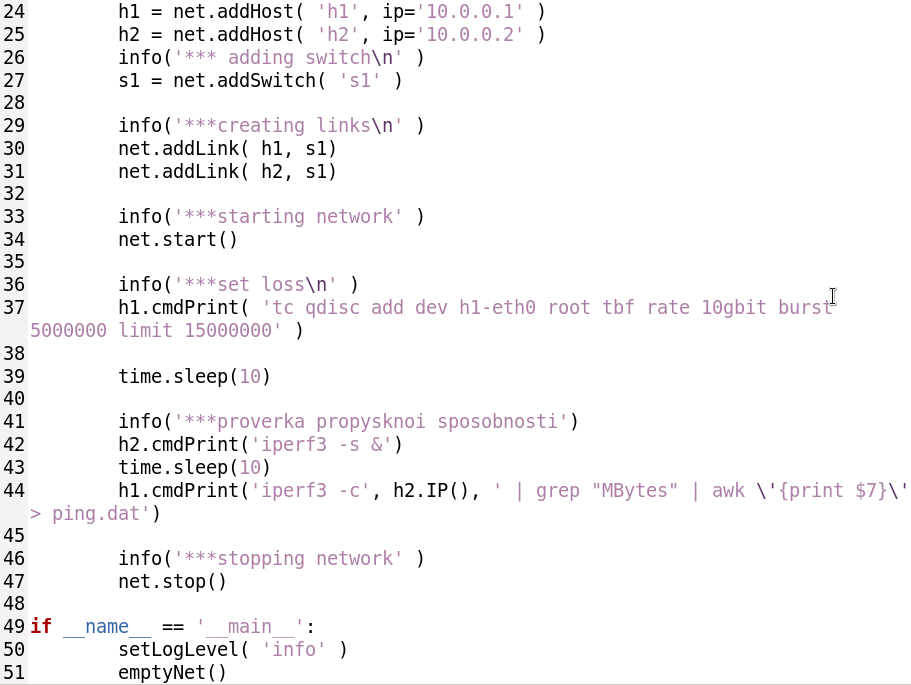{#fig:016 width=70%}

2. Создала Makefile для управления процессом проведения эксперимента (рис. [-@fig:017]).

```
all: ping.dat ping.png

ping.dat:
	sudo python samost.py
	sudo chown mininet:mininet ping.dat

ping.png: ping.dat
	./ping_plot

clean:
	-rm -f *.dat *.png

samost: 
	sudo python samost.py
```

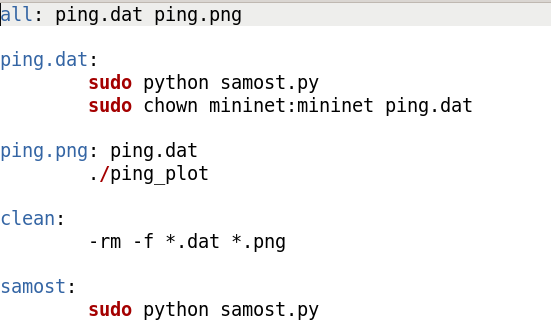{#fig:017 width=70%}

3. В файл ping.dat вывелась информация о скорости (bitrate) (рис. [-@fig:018]).

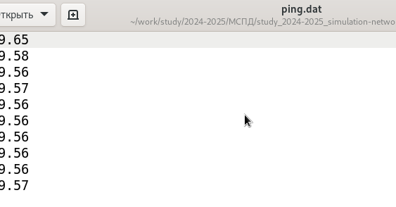{#fig:018 width=70%}

4. По результатам ping.dat создала график (рис. [-@fig:019]).

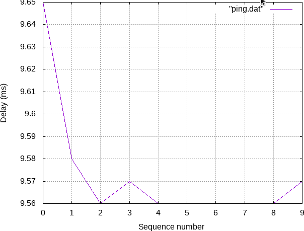{#fig:019 width=70%}

# Выводы

В ходе лабораторной работы я знакомилась с принципами работы дисциплины очереди Token Bucket Filter, которая формирует входящий/исходящий трафик для ограничения пропускной способности, а также получила навыки моделирования и исследования поведения трафика посредством проведения интерактивного и воспроизводимого экспериментов в Mininet.

